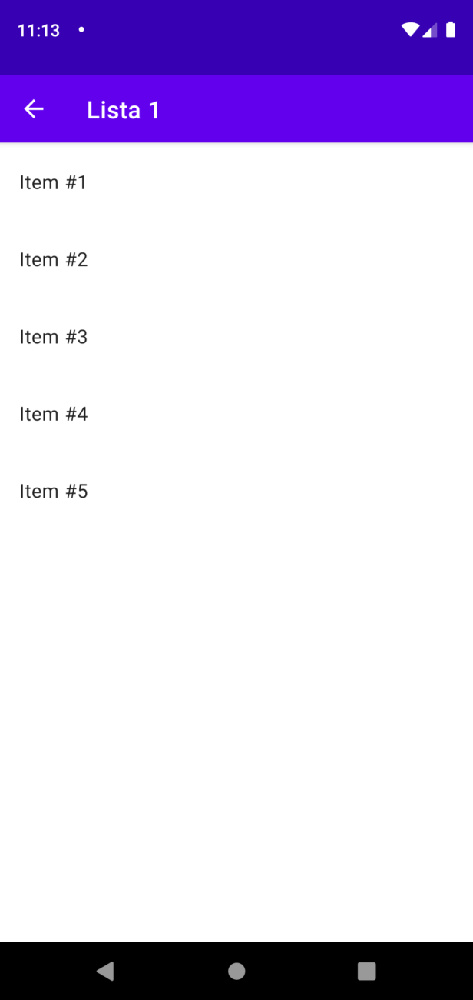

summary: Guía de la API Room
author: www.develou.com
id: guia-room
categories: android,room
environments: Android
status: Published
feedback link: https://github.com/overdrive80/codelab-room/issues

# Guía de la API Room
## Empezando Con Room
Duration: 0:10:00

### Introducción A Room
En este artículo veremos una introducción a Room, una librería de Android que provee una capa de abstracción sobre SQLite, para acceso a bases de datos.

Esta simplifica todas las creaciones del esquema de una base de datos, las relaciones entre ellas y sus operaciones SQL.

Por esta razón aumentará nuestra productividad en comparación al uso del paquete nativo **[android.database.sqlite](https://www.develou.com/android-sqlite-bases-de-datos/)**.

La siguiente es la apertura a una serie de tutoriales para aprender a usar la librería.

### Componentes De Arquitectura

Room es el componente de arquitectura encargado de la persistencia local en la capa de datos de nuestras apps Android.

El siguiente es un diagrama genérico donde vemos como se relaciona con los componentes **[ViewModel](https://www.develou.com/android-viewmodel/)** y **[LiveData](https://www.develou.com/android-livedata/)**.


Donde el **[Repositorio](https://martinfowler.com/eaaCatalog/repository.html)** es una clase encargada de encapsular la lógica requerida para acceder a las fuentes de datos como **Room**.

Este no hace parte de los componentes de arquitectura de Android, pero es un patrón que Google recomienda usar.

De esta forma los datos fluyen desde los controladores de UI hasta llegar a **SQLite** y operar el conjunto de datos.

Y es justo allí donde estaremos trabajando en esta serie de tutoriales.

###  Componentes De Room

En el diagrama anterior vimos varios objetos asociados a Room. Veamos de qué se tratan.

#### RoomDatabase
Es el punto de entrada principal para comunicar el resto de tu app con el esquema relacional de datos.

Esta clase nos oculta la implementación de **[SQLiteOpenHelper](https://developer.android.com/reference/android/database/sqlite/SQLiteOpenHelper)** para facilitarnos el acceso a la base de datos.

Al extender esta clase veremos algo así:

```java
@Database(entities = {Product.class}, version = 1)
public abstract class ProductsDatabase extends RoomDatabase {
    public abstract ProductDao productDao();
}
```

#### Data Access Object (DAO)

Un DAO representa un mapeado de operaciones SQL a métodos.

Lo que quiere decir que crearemos, leeremos, actualizaremos y eliminaremos registros desde ellos.

Las operaciones se verán así normalmente:

```java
@Dao
public interface ProductDao {
@Query("SELECT * FROM product")
List<Product> getAll();

    @Insert
    void insert(Product product);

    @Delete
    void delete(Product product);
}
```
#### Entity
La clase anotada que describe una tabla de la base de datos en Room.

Es decir, un mapeado del comando CREATE de una tabla en SQLite.

Ejemplo:

```java
@Entity
public class Product {
@PrimaryKey
public String id;

    @ColumnInfo(name = "product_name")
    public String name;

    @ColumnInfo(name = "product_price")
    public float price;
}
```

### Implementar Room

Para usar esta librería seguiremos los siguientes pasos:

1. Añadir dependencia de Room a Gradle
2. Crear una Entity por cada modelo
3. Crear DAOs
4. Crear subclase de RoomDatabase
5. Crear Repositorio
6. Testear capa de datos
7. Testear Migraciones

Veremos cómo aplicar cada uno en esta serie de tutoriales, donde crearemos como **[ejemplo](https://www.develou.com/ejemplo-de-room/)** una App sobre listas de compras.

Adicionalmente cubriremos características como:

- CRUDs
- Relaciones (uno a uno, 1 a muchos, muchos a muchos)
- Relaciones (uno a uno, 1 a muchos, muchos a muchos)
- Búsquedas
- Vistas
- Etc.

<!-- ------------------------ -->
## Crear Una Base De Datos Room
Duration: 0:10:00

En este tutorial vamos a crear una base de datos Room para una App Android de **[ejemplo sobre listas de compras](https://www.develou.com/ejemplo-de-room/)**.

El objetivo es crear los componentes vistos en la **[introducción a Room](https://www.develou.com/introduccion-a-room/)** con el fin de mostrar las listas de compras en un TextView. E ilustrar el funcionamiento de la librería y sus componentes.


Puedes descargar el resultado final del tutorial desde el siguiente enlace:

<button>[Descargar](http://develou.com/downloads/room-1.zip)</button>

Empecemos el desarrollo.

### 1. Crear Proyecto En Android Studio

1. Abre Android Studio y crea un nuevo proyecto
2. Selecciona una **Empty Activity** y presiona **Next**
3. Nombra al aplicativo como _Shopping List_ y presiona **Finish**.


### 2. Añadir Dependencias Gradle De Room

1. Abre tu archivo **build.gradle** del módulo y agrega las siguiente dependencias:

    ```java
    dependencies {
    
        implementation "androidx.appcompat:appcompat:$appCompatVersion"
    
        // Room
        implementation "androidx.room:room-runtime:$roomVersion"
        annotationProcessor "androidx.room:room-compiler:$roomVersion"
    
        // Lifecycle
        implementation "androidx.lifecycle:lifecycle-viewmodel:$lifecycleVersion"
        implementation "androidx.lifecycle:lifecycle-livedata:$lifecycleVersion"
        implementation "androidx.lifecycle:lifecycle-common-java8:$lifecycleVersion"
    
        // UI
        implementation "com.google.android.material:material:$materialVersion"
        implementation "androidx.constraintlayout:constraintlayout:$contraintLayoutVersion"
    
        // Testing
        testImplementation "junit:junit:$junitVersion"
        androidTestImplementation "androidx.test.ext:junit:$androidxJunitVersion"
        androidTestImplementation "androidx.test.espresso:espresso-core:$espressoVersion"
    }
    ```
2. Ahora abre **build.gradle** del proyecto y crea un bloque llamado `ext` con el número de las versiones:

    ```java
    ext {
    appCompatVersion = '1.2.0'
    
        roomVersion = '2.2.5'
        lifecycleVersion = '2.2.0'
    
        materialVersion = '1.2.1'
        contraintLayoutVersion = '2.0.4'
    
        junitVersion = '4.13.1'
        espressoVersion = '3.3.0'
        androidxJunitVersion = '1.1.2'
    }
    ```   
Puedes obtener el número de versión más reciente desde **[AndroidX releases](https://developer.android.com/jetpack/androidx/versions)**.

### 3. Crear Una Entidad
La primera característica que vamos a desarrollar es ver las listas de compras que existen.

En este momento la entidad tiene una clave primaria y el nombre como se muestra en el siguiente esquema:


**¿Cómo crear una entidad?**

1. Añade la clase `ShoppingList` que represente a las listas de compra. Cada atributo hará referencia a la columna en la tabla.

    ```java
    public class ShoppingList {
    
    
        private final String mId;
        
        private final String mName;
    
        public ShoppingList(@NonNull String id, @NonNull String name) {
            mId = id;
            mName = name;
        }
    
        public String getId() {
            return mId;
        }
    
        public String getName() {
            return mName;
        }
    }
    ```
2. Actualiza el modelo con las siguientes anotaciones:

    ```java
    @Entity(tableName = "shopping_list")
    public class ShoppingList {
    
        @PrimaryKey
        @NonNull
        @ColumnInfo(name = "id")
        private final String mId;
    
        @NonNull
        @ColumnInfo(name = "name")
        private final String mName;
    
        public ShoppingList(@NonNull String id, @NonNull String name) {
            mId = id;
            mName = name;
        }
    
        public String getId() {
            return mId;
        }
    
        public String getName() {
            return mName;
        }
    }
    ```

**¿Cuál es el propósito de cada una?**

- `@Entity`: Marca una clase para ser mapeada por Room como tabla. El nombre por defecto de la tabla será el de la clase. Para especificar uno distinto usa la propiedad `tableName`.
- `@PrimaryKey`: Marca un atributo como la clave primaria
- `@ColumnInfo`: Permite la personalización de la columna asociada con este campo. El atributo name permite cambiar el nombre de la columna (por defecto es el nombre del campo)
- `@NonNull`: Denota que un campo, parámetro o valor de retorno de un método no puede ser `null`. Con ella Room añade la restricción `NOT NULL` a la columna.

### 4. Crear DAO
Un DAO (Data Access Object) u objeto de acceso a datos es la clase principal donde se definen las interacciones con tu base de datos.

Aunque podemos tener uno solo para todos los accesos, es recomendado crear uno por cada tabla operada.

Ahora bien, ¿qué acciones realizaremos en la tabla `shopping_list`?

Por el momento:

- Insertar una lista de compras
- Obtener todas las listas de compras

Vamos a plasmar esto creando una interfaz (también puede ser una clase abstracta) con el nombre de `ShoppingListDao` con el siguiente código:

```java
@Dao
public interface ShoppingListDao {
    @Query("SELECT * FROM shopping_list")
    LiveData<List<ShoppingList>> getAll();

    @Insert(onConflict = OnConflictStrategy.IGNORE)
    void insert(ShoppingList shoppingList);
}
```

Analicemos las partes:

- `@Dao`: Marca la clase como un DAO.
- `@Insert`: Marca un método de un DAO como una operación de inserción. Pasamos como parámetro la entidad (o colección de esta). La propiedad `onConflict` indica que hacer si existe un conflicto al insertar. `IGNORE` ignora el conflicto y mantiene la fila existente.
- `@Query`: Marca un método de un DAO como una consulta. Usamos un `SELECT` para obtener una lista de las entidades consultadas.

Como ves, `getAll()` retorna un **[LiveData](https://www.develou.com/android-livedata/)**. Esto se debe a que Room se las arregla para interactuar con este componente y enviarnos actualizaciones sobre cambios en el esquema de la tabla shopping_list.

En los siguientes tutoriales iremos expandiendo este DAO según lo requiera la incorporación de nuevas funcionalidades.

### 5. Crear Base De Datos Room

Habíamos dicho en la introducción que `RoomDatabase` es la clase base para todas las bases de datos en Room. Así que debes extender tu clase de base de datos de ella.

Esta provee métodos de acceso directo hacia las operaciones de la base de datos Room, sin embargo deberíamos preferir usar los DAOs para ello.

Crea una nueva clase abstracta llamada `ShoppingListDatabase` y agrega el siguiente código:

```java
@Database(entities = {ShoppingList.class}, version = 1, exportSchema = false)
public abstract class ShoppingListDatabase extends RoomDatabase {

    // Exposición de DAOs
    public abstract ShoppingListDao shoppingListDao();

    private static final String DATABASE_NAME = "shopping-list-db";

    private static ShoppingListDatabase INSTANCE;

    private static final int THREADS = 4;

    public static final ExecutorService dbExecutor = Executors.newFixedThreadPool(THREADS);

    public static ShoppingListDatabase getInstance(final Context context) {
        if (INSTANCE == null) {
            synchronized (ShoppingListDatabase.class) {
                if (INSTANCE == null) {
                    INSTANCE = Room.databaseBuilder(
                            context.getApplicationContext(), ShoppingListDatabase.class,
                            DATABASE_NAME)
                            .build();
                }
            }
        }
        return INSTANCE;
    }

}
```

Resaltemos las características:

- `@Database`: Marca la clase como una base de datos Room. Usamos las propiedades:
    - `entities`: La lista de entidades incluidas en la base de datos.
    - `version`: Versión de la base de datos.
    - `exportSchema`: Le dice a Room que exporte el esquema.
- **Exposición de DAOs**: Creamos un método `get*()` abstracto por cada DAO que tengamos.
- **Singleton**: Usamos este **[patrón](https://es.wikipedia.org/wiki/Singleton)** si queremos una sola instancia de la base de datos abierta (`INSTANCE` y `getInstance()`)
- **Hilos**: Declaramos un `ExecutorService` para ejecutar las operaciones de bases de datos en otros hilos de trabajo y por ende no entorpecer la UI.
- **Creación de la base de datos**: Pasamos al método `Room.databaseBuilder()` el contexto de la aplicación, el tipo de la clase de base de datos y el nombre de la base de datos. Al final usamos `build()` y nuestra instancia se creará.

### 6. Crear Repositorio

El siguiente paso es crear la clase del repositorio de las listas de compras.

**¿Qué debemos tener en cuenta?**

- Declaramos la dependencia al DAO relacionado con las listas de compra
- Declaramos un campo para el **[LiveData](https://developer.android.com/topic/libraries/architecture/livedata)** de las listas de compra
- Añadimos un método por cada operación que nos interese realizar en la tabla (`insert()` y `getAllShoppingLists()`)

Crea la clase `ShoppingListRepository` y pega el siguiente código:

```java
public class ShoppingListRepository {
private final LiveData<List<ShoppingList>> mShoppingLists;
private final ShoppingListDao mShoppingListDao;

    public ShoppingListRepository(Context context) {
        ShoppingListDatabase db = ShoppingListDatabase.getInstance(context);
        mShoppingListDao = db.shoppingListDao();
        mShoppingLists = mShoppingListDao.getAll();
    }

    public LiveData<List<ShoppingList>> getAllShoppingLists() {
        return mShoppingLists;
    }

    public void insert(ShoppingList shoppingList) {
        ShoppingListDatabase.dbExecutor.execute(
                () -> mShoppingListDao.insert(shoppingList)
        );
    }
}
```

En el constructor ordenaremos una carga automática de las listas de compra con el fin de recibir las notificaciones de datos lo más pronto posible.

De esta forma, Room envía a otro hilo de trabajo a las consultas con `LiveData` y se asegura de comunicar los cambios a la UI.

En el caso de la inserción debemos llamar al `ExecutorService` para ejecutarla en su hilo correspondiente.

### 7. Crear ViewModel

Para crear el **[ViewModel](https://www.develou.com/android-viewmodel/)** nospreguntamos:

**¿Cuáles son las interacciones que vendrán desde la interfaz?**

En este momento solo vamos a insertar un par de registros programaticamente y los mostraremos en el `TextView` que aparece en el layout creado automáticamente por la plantilla **Empty Activity**.

Por lo que observaremos la lista de listas de compras con un `LiveData` desde `MainActivity`.

Esto significa que envolveremos a los métodos `getAllShoppingLists()` e `insert()` del repositorio en los del `ViewModel`.

Teniendo en mente lo anterior, crea la clase `ShoppingListViewModel` y materializa estas características:

```java
public class ShoppingListViewModel extends AndroidViewModel {

    private final ShoppingListRepository mRepository;

    private final LiveData<List<ShoppingList>> mShoppingLists;

    public ShoppingListViewModel(@NonNull Application application) {
        super(application);
        mRepository = new ShoppingListRepository(application);
        mShoppingLists = mRepository.getAllShoppingLists();
    }

    public LiveData<List<ShoppingList>> getShoppingLists() {
        return mShoppingLists;
    }

    public void insert(ShoppingList shoppingList) {
        mRepository.insert(shoppingList);
    }
}
```

En el constructor cargaremos todas las listas de compra para actualizar la vista inmediatamente.

### 8. Prepoblar La Base De Datos

Si queremos que la base de datos comience con registros predefinidos podemos hacer uso de `RoomDatabase#Callback`.

Crea una `callback` en la clase de base de datos y sobrescribe su método `onCreate()` para agrega 2 listas de compras:

```java
// Prepoblar base de datos con callback
private static final RoomDatabase.Callback mRoomCallback = new Callback() {
    @Override
    public void onCreate(@NonNull SupportSQLiteDatabase db) {
        super.onCreate(db);
    
        dbExecutor.execute(() -> {
            ShoppingListDao dao = INSTANCE.shoppingListDao();

            ShoppingList list1 = new ShoppingList("1", "Lista de ejemplo");
            ShoppingList list2 = new ShoppingList("2", "Banquete de Navidad");

            dao.insert(list1);
            dao.insert(list2);
        });
     }
};
```    

Luego la añádela con `addCallback()` en el `builder`.

```java 
INSTANCE = Room.databaseBuilder(
                context.getApplicationContext(), ShoppingListDatabase.class,
                DATABASE_NAME)
                .addCallback(mRoomCallback)
                .build();
```

### 9. Mostrar Datos En La Actividad
La actividad creada por defecto trae consigo un layout con un `TextView`. Algo así:

```
<?xml version="1.0" encoding="utf-8"?>
<androidx.constraintlayout.widget.ConstraintLayout xmlns:android="http://schemas.android.com/apk/res/android"
xmlns:app="http://schemas.android.com/apk/res-auto"
xmlns:tools="http://schemas.android.com/tools"
android:layout_width="match_parent"
android:layout_height="match_parent"
tools:context=".MainActivity">

    <TextView
        android:id="@+id/db_text"
        android:layout_width="wrap_content"
        android:layout_height="wrap_content"
        android:text="Hello World!"
        app:layout_constraintBottom_toBottomOf="parent"
        app:layout_constraintLeft_toLeftOf="parent"
        app:layout_constraintRight_toRightOf="parent"
        app:layout_constraintTop_toTopOf="parent" />

</androidx.constraintlayout.widget.ConstraintLayout>
```

Finalizando, conecta ese `view` con los datos de la tabla.

Es decir, obtenemos el `ViewModel` en el método `onCreate()` y observamos su contenido con `observe()`:

```java
public class MainActivity extends AppCompatActivity {

    private ShoppingListViewModel mViewModel;

    @Override
    protected void onCreate(Bundle savedInstanceState) {
        super.onCreate(savedInstanceState);
        setContentView(R.layout.activity_main);

        TextView dbText = findViewById(R.id.db_text);

        ViewModelProvider.AndroidViewModelFactory factory =
                ViewModelProvider.AndroidViewModelFactory.getInstance(getApplication());

        mViewModel = new ViewModelProvider(this, factory)
                .get(ShoppingListViewModel.class);

        mViewModel.getShoppingLists().observe(this, shoppingLists -> {
                    StringBuilder sb = new StringBuilder();
                    for (ShoppingList list : shoppingLists) {
                        sb.append(list.getName()).append("\n");
                    }
                    dbText.setText(sb.toString());
                }
        );
    }
}
```

Al usar un `StringBuilder` podemos concatenar el nombre de cada lista y proyectarlo en el texto con `setText()`.

Y para terminar, ejecuta el proyecto. Deberías ver lo siguiente:


## Insertar Datos Con Room
Duration: 0:10:00

En este tutorial verás cómo insertar datos con Room desde una actividad de creación de listas de compras. Recuerda que puedes ver el alcance general de este ejemplo en la [**descripción de la App**](https://www.develou.com/ejemplo-de-room/).

Al haber [**creado la base de datos**](https://www.develou.com/base-de-datos-room/) de listas de compra, ahora agregaremos un `RecyclerView` para mejorar la vista de `MainActivity`.

Adicionalmente, pondremos un `FAB` que inicie una nueva actividad de creación. El siguiente boceto muestra nuestro plan:


Puedes descargar el código completo desde el siguiente link:

<button>[Descargar](http://develou.com/downloads/room-2-nKtrws8xNUej5EdLl70nZw.zip)</button>

Codifiquemos la solución.

### 1. Añadir RecyclerView Al Layout
Reemplazar el layout actual requiere las siguientes acciones:

- Reemplazar `ConstraintLayout` raíz por `CoordinatorLayout`.
- Reemplazar `TextView` por `RecyclerView`.
- Añadir `FAB` en la parte inferior derecha.
- Añadir icono con símbolo ‘+’.
- Añadir soporte de vectores.

Basado en ello, abre el layout `activity_main.xml` y pega el siguiente código:

```
<?xml version="1.0" encoding="utf-8"?>
<androidx.coordinatorlayout.widget.CoordinatorLayout xmlns:android="http://schemas.android.com/apk/res/android"
xmlns:app="http://schemas.android.com/apk/res-auto"
xmlns:tools="http://schemas.android.com/tools"
android:layout_width="match_parent"
android:layout_height="match_parent"
tools:context=".shoppinglists.MainActivity">

    <androidx.recyclerview.widget.RecyclerView
        android:id="@+id/list"
        android:layout_width="match_parent"
        android:layout_height="match_parent"
        app:layoutManager="androidx.recyclerview.widget.LinearLayoutManager"
        app:layout_constraintBottom_toBottomOf="parent"
        app:layout_constraintEnd_toEndOf="parent"
        app:layout_constraintHorizontal_bias="0.5"
        app:layout_constraintStart_toStartOf="parent"
        app:layout_constraintTop_toTopOf="parent" />

    <com.google.android.material.floatingactionbutton.FloatingActionButton
        android:id="@+id/floating_action_button"
        android:layout_width="wrap_content"
        android:layout_height="wrap_content"
        android:layout_gravity="bottom|end"
        android:layout_margin="16dp"
        app:srcCompat="@drawable/ic_add_24"/>
</androidx.coordinatorlayout.widget.CoordinatorLayout>
```

Para agregar el icono haz clic derecho en tu carpeta **drawable**, presiona **New**, luego **Vector Asset**. Seguido selecciona **Clip Art** en **Asset Type**, escribe **«add»** en el diálogo emergente y selecciona el icono que necesitamos.


Nómbralo **ic_add_24** y confirma su inclusión.

Ahora abre el archivo **build.gradle** del módulo y pega la siguiente instrucción para habilitar el uso de vectores en el proyecto Android Studio:

```
defaultConfig {
    vectorDrawables.useSupportLibrary = true
}
```
Sincroniza y tendremos completa nuestra interfaz para mostrar las listas de compras.

### 2. Crear Adaptador Del RecyclerView
El **layout** para el ítem de la lista es simple. Crea el archivo `shopping_list_item.xml` y recubre un `TextView` con un `ConstraintLayout`:

```
<?xml version="1.0" encoding="utf-8"?>
<androidx.constraintlayout.widget.ConstraintLayout xmlns:android="http://schemas.android.com/apk/res/android"
xmlns:app="http://schemas.android.com/apk/res-auto"
xmlns:tools="http://schemas.android.com/tools"
android:layout_width="match_parent"
android:padding="@dimen/normal_padding"
android:layout_height="?listPreferredItemHeight">

    <TextView
        android:id="@+id/name"
        android:layout_width="wrap_content"
        android:layout_height="wrap_content"
        app:layout_constraintBottom_toBottomOf="parent"
        app:layout_constraintEnd_toEndOf="parent"
        app:layout_constraintHorizontal_bias="0.0"
        app:layout_constraintStart_toStartOf="parent"
        app:layout_constraintTop_toTopOf="parent"
        tools:text="Lista de ejemplo" />
</androidx.constraintlayout.widget.ConstraintLayout>
```

A continuación, crea la clase `ShoppingListAdapter`.

La idea es _inflar_ el layout del ítem. Agregar un método para actualizar los ítems y bindear el nombre de las listas de compra con el `TextView` existente.

**Solución:**

```java
public class ShoppingListAdapter
extends RecyclerView.Adapter<ShoppingListViewHolder> {

    private List<ShoppingList> mShoppingLists;

    @NonNull
    @Override
    public ShoppingListViewHolder onCreateViewHolder(@NonNull ViewGroup parent, int viewType) {
        return ShoppingListViewHolder.create(parent);
    }

    @Override
    public void onBindViewHolder(@NonNull ShoppingListViewHolder holder, int position) {
        ShoppingList item = mShoppingLists.get(position);
        holder.bind(item);
    }

    @Override
    public int getItemCount() {
        return mShoppingLists == null ? 0 : mShoppingLists.size();
    }

    public void setItems(List<ShoppingList> items) {
        mShoppingLists = items;
        notifyDataSetChanged();
    }

}
```

Crea también la clase `ShoppingListViewHolder` para procesar el _inflado_ y el _binding_ de cada ítem:

```java
public class ShoppingListViewHolder extends RecyclerView.ViewHolder {
private final TextView mNameText;

    public ShoppingListViewHolder(@NonNull View itemView) {
        super(itemView);
        mNameText = itemView.findViewById(R.id.name);
    }

    public void bind(ShoppingList item) {
        mNameText.setText(item.getName());
    }

    public static ShoppingListViewHolder create(ViewGroup parent) {
        View v = LayoutInflater.from(parent.getContext())
                .inflate(R.layout.shopping_list_item, parent, false);
        return new ShoppingListViewHolder(v);
    }
}
```

### 3. Poblar RecyclerView Desde Room
**¿Cómo ponemos el contenido de la base de datos en la lista?**

- Abre `MainActivity`.
- Obtén la instancia del `RecyclerView`.
- Crea una instancia del **Adaptador** y asígnala al **recycler**.
- Dirígete donde observamos el `LiveData` del `ViewModel`. Reemplaza ese código por la llamada del método `setItems()` del adaptador.

Lo anterior reflejado en código sería así:

```java
public class MainActivity extends AppCompatActivity {

    private ShoppingListViewModel mViewModel;
    private RecyclerView mList;
    private ShoppingListAdapter mAdapter;

    @Override
    protected void onCreate(Bundle savedInstanceState) {
        super.onCreate(savedInstanceState);
        setContentView(R.layout.activity_main);

        ViewModelProvider.AndroidViewModelFactory factory =
                ViewModelProvider.AndroidViewModelFactory.getInstance(getApplication());

        mViewModel = new ViewModelProvider(this, factory)
                .get(ShoppingListViewModel.class);

        setupList();

        setupFab();
    }

    private void setupList() {
        mList = findViewById(R.id.list);
        mAdapter = new ShoppingListAdapter();
        mList.setAdapter(mAdapter);
        mViewModel.getShoppingLists().observe(this, mAdapter::setItems);
    }

    private void setupFab() {
        findViewById(R.id.floating_action_button)
                .setOnClickListener(view -> addNewShoppingList());
    }

    private void addNewShoppingList() {
        startActivity(new Intent(this, AddShoppingListActivity.class));
    }
}
```

Si ejecutas el proyecto en este punto deberías ver este resultado:


### 4. Añadir Actividad De Creación De Listas De Compras
Para la actividad de **«Nueva lista»** usaremos una plantilla **Empty Activity**. El nombre de la clase será `AddShoppingListActivity`.

El **layout** consta de un [**EditText**](https://www.develou.com/edittext-android/) y un [botón](https://www.develou.com/controles-tutorial-botones-android/) de **guardar**. Abre `activity_add_shopping_list.xml` para satisfacer el diseño:

```
<?xml version="1.0" encoding="utf-8"?>
<androidx.constraintlayout.widget.ConstraintLayout xmlns:android="http://schemas.android.com/apk/res/android"
xmlns:app="http://schemas.android.com/apk/res-auto"
xmlns:tools="http://schemas.android.com/tools"
android:layout_width="match_parent"
android:layout_height="match_parent"
android:padding="@dimen/normal_padding"
tools:context=".addshoppinglist.AddShoppingListActivity">

    <Button
        android:id="@+id/create_button"
        style="?attr/materialButtonOutlinedStyle"
        android:layout_width="wrap_content"
        android:layout_height="wrap_content"
        android:layout_marginTop="8dp"
        android:text="@string/create_button"
        app:layout_constraintEnd_toEndOf="parent"
        app:layout_constraintHorizontal_bias="1.0"
        app:layout_constraintStart_toStartOf="parent"
        app:layout_constraintTop_toBottomOf="@+id/name_layout" />

    <com.google.android.material.textfield.TextInputLayout
        android:id="@+id/name_layout"
        style="@style/Widget.MaterialComponents.TextInputLayout.OutlinedBox"
        android:layout_width="match_parent"
        android:layout_height="wrap_content"
        android:hint="@string/shopping_list_hint"
        app:layout_constraintEnd_toEndOf="parent"
        app:layout_constraintHorizontal_bias="0.5"
        app:layout_constraintStart_toStartOf="parent"
        app:layout_constraintTop_toTopOf="parent">

        <com.google.android.material.textfield.TextInputEditText
            android:layout_width="match_parent"
            android:id="@+id/name_field"
            android:layout_height="wrap_content" />
    </com.google.android.material.textfield.TextInputLayout>

</androidx.constraintlayout.widget.ConstraintLayout>
```

También debemos asegurarnos de retornar con el **Up Button**. Por lo que habilitamos su aparición con en `onCreate()`:`

```java
public class AddShoppingListActivity extends AppCompatActivity {

    @Override
    protected void onCreate(Bundle savedInstanceState) {
        super.onCreate(savedInstanceState);
        setContentView(R.layout.activity_add_shopping_list);

        getSupportActionBar().setDisplayHomeAsUpEnabled(true);
    }

    

    @Override
    public boolean onSupportNavigateUp() {
        onBackPressed();
        return true;
    }
}
```

### 5. Guardar Lista Nueva En Base De Datos
Al presionar el botón de **crear**, debemos comunicárselo al `ViewModel` que es el encargado de insertar datos con Room con su método `insert()`.

**¿Cómo lo haces?**

- Obtén la instancia de `ShoppingListViewModel` en `onCreate()`.
- Obtén la instancia del boton de **crear**.
- Asigna un objeto `OnClickListener` al botón.
- Llama a `insert()` del view model en `onClick()`.
- Finaliza la actividad.

Al completar las tareas anteriores tu actividad de creación se verá así:

```java
public class AddShoppingListActivity extends AppCompatActivity {

    @Override
    protected void onCreate(Bundle savedInstanceState) {
        super.onCreate(savedInstanceState);
        setContentView(R.layout.activity_add_shopping_list);

        getSupportActionBar().setDisplayHomeAsUpEnabled(true);

        ViewModelProvider.AndroidViewModelFactory factory
                = ViewModelProvider.AndroidViewModelFactory.getInstance(getApplication());
        ShoppingListViewModel vm = new ViewModelProvider(this, factory)
                .get(ShoppingListViewModel.class);

        setupCreateButton(vm);
    }

    private void setupCreateButton(ShoppingListViewModel vm) {
        findViewById(R.id.create_button).setOnClickListener(
                view -> {
                    // Obtener valor del campo de texto
                    EditText nameField =  findViewById(R.id.name_field);
                    String name = nameField.getText().toString();

                    // Ignorar acción si hay 0 caracteres
                    if (name.isEmpty()) {
                        return;
                    }

                    // Crear entidad y guardarla
                    String id = UUID.randomUUID().toString();
                    ShoppingList shoppingList = new ShoppingList(id, name);
                    vm.insert(shoppingList);

                    // Ir a la lista
                    finish();
                });
    }

    @Override
    public boolean onSupportNavigateUp() {
        onBackPressed();
        return true;
    }
}
```

No olvides iniciar esta actividad al presionar el `FAB` de la lista:

```java
private void setupFab() {
    findViewById(R.id.floating_action_button)
            .setOnClickListener(view -> addNewShoppingList());
}

private void addNewShoppingList() {
    startActivity(new Intent(this, AddShoppingListActivity.class));
}
```

Ejecuta el proyecto y comprueba la inserción de listas.


> aside positive **Nota**: Aunque en este ejemplo estamos usando un solo `ViewModel`, normalmente debes crear uno por cada controlador de vista.

### 6. Insertar Una Lista De Entities
Room tiene la capacidad de [**insertar múltiples entidades**](https://developer.android.com/training/data-storage/room/accessing-data#convenience-insert) si pasamos una lista como parámetro.

Para ver su funcionamiento agreguemos a `ShoppingListDao` el siguiente método:

```java
@Insert(onConflict = OnConflictStrategy.IGNORE)
void insertShoppingLists(List<ShoppingList> lists);
```

Ahora desde `ShoppingListDatabase` creamos una lista de 5 elementos para reemplazar la prepoblación que hacíamos antes de forma individual:

```java
// Prepoblar base de datos con callback
private static final RoomDatabase.Callback mRoomCallback = new Callback() {
    @Override
    public void onCreate(@NonNull SupportSQLiteDatabase db) {
        super.onCreate(db);

        dbExecutor.execute(() -> {
            ShoppingListDao dao = INSTANCE.shoppingListDao();

            List<ShoppingList> lists = new ArrayList<>();
            for (int i = 0; i < 5; i++) {
                String id = UUID.randomUUID().toString();
                lists.add(new ShoppingList(id, "Lista " + (i+1)));
            }

            dao.insertShoppingLists(lists);
        });
    }
};
```

De esta forma, podremos hacer en una misma transacción un **bulk** de inserciones de listas de compras.

## Consultar Datos Con Room
Duration: 0:10:00

En este tutorial veremos con más detalle como consultar datos con Room y la anotación `@Query`.

> aside positive **Más específicamente**: consultar pasando uno o múltiples parámetros y como consultar solo las columnas que necesitemos.

¿Cómo lo reflejaremos en nuestra [**App de listas de compras**](https://www.develou.com/ejemplo-de-room/)?

Añadiremos un filtro simple en la actividad principal y crearemos una actividad de edición como lo ilustra el siguiente boceto:


Puedes descargar el código completo del proyecto desde el siguiente enlace:

<button>[Descargar](http://develou.com/downloads/room-3-3ebCorpdZkStjqMyKYO1og.zip)</button>

Veamos de qué va la solución.

### 1. Enlazar Un Parámetro En Una Consulta
Los métodos anotados con `@Query` en nuestros DAOs pueden [**recibir parámetros**](https://developer.android.com/training/data-storage/room/accessing-data#query-params) con el fin de enlazarlos con argumentos de la consulta.

Para ello usamos la sintaxis `:nombre` con el fin de diferenciar el contexto.

**Ejemplo:**

Podemos añadir como parámetro el **ID** que proporcione el item cliqueado en el **recyclerView** para consultar la lista de compras.

Abre `ShoppingListDao` y crea un nuevo método llamado `getShoppingList()` que reciba el **ID** y _bindealo_ así:

```java
@Query("SELECT * FROM shopping_list WHERE id = :id LIMIT 1")
LiveData<ShoppingList> getShoppingList(String id);
```

De esta forma, `:id` será reemplazado por el parámetro `id`.

### 2. Enlazar Múltiples Parámetros En Una Consulta
Con la misma lógica, Room también soporta el enlace de una [lista de parámetros](https://developer.android.com/training/data-storage/room/accessing-data#query-collection-args). La librería genera automáticamente la consulta en tiempo de ejecución, asignando cada elemento en la sentencia.

**Ejemplo:**

Probemos esta característica con los filtros por categoría propuestos en el boceto al inicio del tutorial.

Lo primero será agregar la categoría como columna a la entidad `ShoppingList` así:

```java
@Nullable
@ColumnInfo(name = "category")
private final String mCategory;
```

Ahora crea un nuevo método en el DAO que se llame `getShoppingListsByCategories()` y pásale una lista de strings como parámetro. Bindeala en un operador **IN**:

```java
@Query("SELECT * FROM shopping_list WHERE category IN(:categories)")
LiveData<List<ShoppingList>> getShoppingListsByCategories(List<String> categories);
```

Y listo, de esa forma consultaremos los elementos de la actividad principal cuando agreguemos los check boxes para filtrar.

### 3. Seleccionar Un Subconjunto De Columnas En Room
Room nos permite retornar POJOs personalizados que representen solo las columnas que deseamos retornar si el caso de uso lo amerita.

**Por ejemplo**:

Añade dos columnas más a `ShoppingList` para la fecha de creación y última modificación. Con estas serían ya 5 columnas de nuestra tabla (la propiedad `defaultValue` permite asignar un valor por defecto al campo si no es definido en la inserción).

```java
@ColumnInfo(name = "created_date", defaultValue = "CURRENT_TIMESTAMP")
private final String mCreatedDate;

@ColumnInfo(name = "last_updated", defaultValue = "CURRENT_TIMESTAMP")
private final String mLastUpdated;
```

Ahora crea una nueva clase llamada `ShoppingListForList` y añade solo dos campos: `id` y `name`.

```java
public class ShoppingListForList {
public String id;
public String name;
}
```

Termina asignado esta clase como tipo de retorno y seleccionando las dos columnas objetivo:

```java
@Query("SELECT id, name FROM shopping_list")
LiveData<List<ShoppingListForList>> getAll();

@Query("SELECT id, name FROM shopping_list WHERE category IN(:categories)")
LiveData<List<ShoppingListForList>> getShoppingListsByCategories(List<String> categories);
```

Consultando solo las columnas necesarias optimizas la velocidad de tus consultas.

> aside positive **Nota**: Modifica los métodos del repositorio y **ViewModel** para que acepten este tipo en sus retornos.


### 4. Insertar Registros Parcialmente
También es posible usar POJOs arbitrarios que representen la inserción con tan solo columnas que nos interesen.

**Ejemplo:**

Vamos a crear una entidad llamada `ShoppingListInsert` con solo 3 campos: `id`, `name` y `category`. Donde `category` tomará como valor inicial una de las tres categorías usadas para el ejemplo:

```java
public class ShoppingListInsert {
String id;
String name;
String category = generateCategory();

    public ShoppingListInsert(String id, String name) {
        this.id = id;
        this.name = name;
    }

    public static String generateCategory() {
        String[] categories = new String[]{"Fitness", "Eventos", "Rápidas"};
        return categories[new Random().nextInt(3)];
    }
}
```

Ahora creamos un método para insertar este tipo de objetos llamado `partialInsert()`. Es importante pasarle la propiedad `entity` con la entidad original a la que Room interpretará:

```java
@Insert(onConflict = OnConflictStrategy.IGNORE, entity = ShoppingList.class)
void partialInsert(ShoppingListInsert shoppingList);

@Insert(onConflict = OnConflictStrategy.IGNORE, entity = ShoppingList.class)
void insertShoppingLists(List<ShoppingListInsert> lists);
```

Actualiza también el método `insertShoppingLists()` para la inserción múltiple.

### 5. Actualizar Versión De La Base De Datos
Debido a que nuestro esquema ha cambiado, iremos a `ShoppingListDatabase` y cambia la propiedad `version` por el valor **2**.

Adicionalmente, agrega a la creación de la instancia con el `builder` el método `fallbackToDestructiveMigration()` para eliminar todo el contenido actual de la base de datos y recrearlo con la siguiente versión.

```java
INSTANCE = Room.databaseBuilder(
        context.getApplicationContext(), ShoppingListDatabase.class,
        DATABASE_NAME)
        .addCallback(mRoomCallback)
        .fallbackToDestructiveMigration()
        .build();
```

### 6. Filtrar Listas De Compras
Una vez modificado nuestra capa de datos para satisfacer las características de nuestros bocetos, comenzaremos a crear la interfaz propuesta.

Comencemos con el filtro:

1. Mueve el `RecyclerView` de `activity_main.xml` a un nuevo layout llamado `main_content.xml`. Android Studio puede hacerlo automáticamente si das clic derecho en el componente y presionas **Refactor > Layout**.

   

2. Abre el nuevo layout, agrega como nodo raíz un `ConstraintLayout` y sitúa en la parte superior a tres etiquetas [**CheckBox**](https://www.develou.com/checkbox-android/). La solución sería:

    ```
    <?xml version="1.0" encoding="utf-8"?>
    
    <androidx.constraintlayout.widget.ConstraintLayout
    xmlns:android="http://schemas.android.com/apk/res/android"
    xmlns:app="http://schemas.android.com/apk/res-auto"
    xmlns:tools="http://schemas.android.com/tools"
    android:layout_width="match_parent"
    android:layout_height="match_parent"
    android:padding="@dimen/normal_padding">
    
        <CheckBox
            android:id="@+id/filter_1"
            android:layout_width="wrap_content"
            android:layout_height="wrap_content"
            android:text="@string/filter_1"
            app:layout_constraintEnd_toStartOf="@+id/filter_2"
            app:layout_constraintHorizontal_bias="0.5"
            app:layout_constraintStart_toStartOf="parent"
            app:layout_constraintTop_toTopOf="parent" />
    
        <CheckBox
            android:id="@+id/filter_2"
            android:layout_width="wrap_content"
            android:layout_height="wrap_content"
            android:text="@string/filter_2"
            app:layout_constraintEnd_toStartOf="@+id/filter_3"
            app:layout_constraintHorizontal_bias="0.5"
            app:layout_constraintStart_toEndOf="@+id/filter_1"
            app:layout_constraintTop_toTopOf="parent" />
    
        <CheckBox
            android:id="@+id/filter_3"
            android:layout_width="wrap_content"
            android:layout_height="wrap_content"
            android:text="@string/filter_3"
            app:layout_constraintEnd_toEndOf="parent"
            app:layout_constraintHorizontal_bias="0.5"
            app:layout_constraintStart_toEndOf="@+id/filter_2"
            app:layout_constraintTop_toTopOf="parent" />
    
        <androidx.recyclerview.widget.RecyclerView
            android:id="@+id/list"
            android:layout_width="0dp"
            android:layout_height="0dp"
            android:layout_marginTop="@dimen/normal_padding"
            app:layoutManager="androidx.recyclerview.widget.LinearLayoutManager"
            app:layout_constraintBottom_toBottomOf="parent"
            app:layout_constraintEnd_toEndOf="parent"
            app:layout_constraintHorizontal_bias="0.5"
            app:layout_constraintStart_toStartOf="parent"
            app:layout_constraintTop_toBottomOf="@+id/filter_2"
            tools:listitem="@layout/shopping_list_item"
            tools:showIn="@layout/activity_main" />
    
    </androidx.constraintlayout.widget.ConstraintLayout>
    ```

3. Procesa las categorías seleccionadas agregando al `ViewModel` un `LiveData` para ellas. Complementariamente, provee un método para añadirlas y otro para removerlas:

    ```java
    public class ShoppingListViewModel extends AndroidViewModel {
    
        // Filtros observados
        private final MutableLiveData<List<String>> mCategories
                = new MutableLiveData<>(new ArrayList<>());
    
    
        // Filtros
        private final List<String> mFilters = new ArrayList<>();
        
    
        public void addFilter(String category) {
            mFilters.add(category);
            mCategories.setValue(mFilters);
        }
    
        public void removeFilter(String category) {
            mFilters.remove(category);
            mCategories.setValue(mFilters);
        }
    }
    ```

4. Usaremos una transformación `switchMap()` para obtener las listas de compras por categorías en el constructor del `ViewModel`. Si no existen categorías marcadas entonces obtenemos todos los registros:

    ```java
    public ShoppingListViewModel(@NonNull Application application) {
    super(application);
    mRepository = new ShoppingListRepository(application);
    
            // Obtener listas de compras por categorías
            mShoppingLists = Transformations.switchMap(
                    mCategories,
                    categories -> {
                        if (categories.isEmpty()) {
                            return mRepository.getShoppingLists();
                        } else {
                            return mRepository.getShoppingListsWithCategories(categories);
                        }
                    }
            );
    }
    ```

5. Por último, actualizamos `mFilters` desde `MainActivity` a través del método `setupFilters()`. Aquí conseguiremos las referencias de los **CheckBoxes** y les añadimos una escucha. Esta añade o elimina los filtros dependiendo de su estado.

    ```java
    private void setupFilters() {
    mFilters = new ArrayList<>();
    mFilters.add(findViewById(R.id.filter_1));
    mFilters.add(findViewById(R.id.filter_2));
    mFilters.add(findViewById(R.id.filter_3));
    
            // Definir escucha de filtros
            CompoundButton.OnCheckedChangeListener listener = (compoundButton, checked) -> {
                String category = compoundButton.getText().toString();
                if (checked) {
                    mViewModel.addFilter(category);
                } else {
                    mViewModel.removeFilter(category);
                }
            };
    
            // Setear escucha
            for (CheckBox filter : mFilters) {
                filter.setOnCheckedChangeListener(listener);
            }
    }
    ```

Si ejecutas el proyecto podrás filtrar las listas por la categoría asignada:

 

### 7. Editar Listas De Compras
Por el momento la pantalla de edición estará vacía. El único dato que desplegaremos será el nombre en la [**Toolbar**](https://www.develou.com/toolbar-en-android-creacion-de-action-bar-en-material-design/).

Veamos cómo conseguirlo:

#### 1. Crear Actividad De Edición
Añade una nueva actividad yendo a **File > New > Activity > Empty Activity** y nombrala `EditShoppingListActivity`. Seguido, habilita la navegación hacia arriba:

```java
public class EditShoppingListActivity extends AppCompatActivity {

    public static final String EXTRA_SHOPPING_LIST_ID = "com.develou.shoppinglist.shoppingListId";

    @Override
    protected void onCreate(Bundle savedInstanceState) {
        super.onCreate(savedInstanceState);
        setContentView(R.layout.activity_edit_shopping_list);
        
        // Obtener id de la lista de compras
        String id = getIntent().getStringExtra(EXTRA_SHOPPING_LIST_ID);
        
        setupActionBar();
    }

    private void setupActionBar() {
        ActionBar actionBar = getSupportActionBar();

        actionBar.setDisplayHomeAsUpEnabled(true);
    }

    @Override
    public boolean onSupportNavigateUp() {
        onBackPressed();
        return true;
    }
}
```

Recuerda que recibiremos el id de la lista de compras, por lo que es necesario extraerlo desde el extra.

#### 2. Añadir Escucha De Ítems Al Adaptador
Hasta el momento nuestro **adaptador** no reaccionaba a los eventos de clics sobre sus ítems, así que añadiremos una interfaz que se encargue de esta responsabilidad.

Esto implica:

- Añadir una interfaz de escucha al adaptador.
- Procesar el **clic** sobre cada ítem en el `ViewHolder`.
- Añadir un método para asignar la escucha.
- Ubicar como clase interna al `ViewHolder`.

Al codificar todas las características mencionadas tendrás:

```java
public class ShoppingListAdapter
extends RecyclerView.Adapter<ShoppingListAdapter.ShoppingListViewHolder> {

    private List<ShoppingListForList> mShoppingLists;
    private ItemListener mItemListener;

    @NonNull
    @Override
    public ShoppingListViewHolder onCreateViewHolder(@NonNull ViewGroup parent, int viewType) {
        return new ShoppingListViewHolder(
                LayoutInflater.from(parent.getContext())
                .inflate(R.layout.shopping_list_item, parent, false)
        );
    }

    @Override
    public void onBindViewHolder(@NonNull ShoppingListViewHolder holder, int position) {
        ShoppingListForList item = mShoppingLists.get(position);
        holder.bind(item);
    }

    @Override
    public int getItemCount() {
        return mShoppingLists == null ? 0 : mShoppingLists.size();
    }

    public void setItems(List<ShoppingListForList> items) {
        mShoppingLists = items;
        notifyDataSetChanged();
    }

    public void setItemListener(ItemListener listener) {
        mItemListener = listener;
    }

    interface ItemListener {
        void onClick(ShoppingListForList shoppingList);
    }

    public class ShoppingListViewHolder extends RecyclerView.ViewHolder {
        private final TextView mNameText;

        public ShoppingListViewHolder(@NonNull View itemView) {
            super(itemView);
            mNameText = itemView.findViewById(R.id.name);
            itemView.setOnClickListener(view -> {
                if (mItemListener != null) {
                    ShoppingListForList clickedItem = mShoppingLists.get(getAdapterPosition());
                    mItemListener.onClick(clickedItem);
                }
            });
        }

        public void bind(ShoppingListForList item) {
            mNameText.setText(item.name);
        }
    }
}
```

#### 3 Iniciar Actividad De Edición
Añade una escucha al adaptador en `MainActivity`. La idea es enviar el `Id` de la lista de compras en el `Intent` explícito con la finalidad de procesarlo en la actividad de edición.

```java
private void setupList() {
    mList = findViewById(R.id.list);
    mAdapter = new ShoppingListAdapter();
    mList.setAdapter(mAdapter);
    
    // Asignar escucha de ítems
    mAdapter.setItemListener(this::editShoppingList);
    
    // Observar cambios de listas de compras
    mViewModel.getShoppingLists().observe(this, mAdapter::setItems);
}


private void editShoppingList(ShoppingListForList shoppingList) {
    Intent intent = new Intent(MainActivity.this,
    EditShoppingListActivity.class);
    intent.putExtra(EditShoppingListActivity.EXTRA_SHOPPING_LIST_ID,
    shoppingList.id);
    startActivity(intent);
}
```
Crea un nuevo método en el repositorio para cargar una lista de compras por `ID`:

```java
public LiveData<ShoppingList> getShoppingList(String id){
    return mShoppingListDao.getShoppingList(id);
}
```

#### 4 Crear ViewModel Para Edición
Luego, crea la clase `EditShoppingListViewModel` y:

- Hazla extender de `AndroidViewModel`.
- Añade un `LiveData` para el `ID` de la lista.
- Añade un `LiveData` para la lista a editar. Relaciónala con el `ID` a través de una transformación `switchMap()`.
- Agrégale un método para cargar la lista con el repositorio.

El código sería el siguiente:

```java
public class EditShoppingListViewModel extends AndroidViewModel {

    private final ShoppingListRepository mRepository;

    private final MutableLiveData<String> mShoppingListId = new MutableLiveData<>();

    private final LiveData<ShoppingList> mShoppingList;

    public EditShoppingListViewModel(@NonNull Application application) {
        super(application);
        mRepository = new ShoppingListRepository(application);
        mShoppingList = Transformations.switchMap(
                mShoppingListId,
                mRepository::getShoppingList
        );
    }

    public void start(String id){
        if(id.equals(mShoppingListId.getValue())){
            return;
        }
        mShoppingListId.setValue(id);
    }

    public LiveData<ShoppingList> getShoppingList() {
        return mShoppingList;
    }
}
```

Para finalizar, actualizamos la interfaz al observar `mShoppingList` en la actividad. Cuando se cargue la lista de compras a editar cambiamos el título de la `Toolbar` por el nombre del registro:

```java
private void setupActionBar() {
ActionBar actionBar = getSupportActionBar();

        actionBar.setDisplayHomeAsUpEnabled(true);

        mViewModel.getShoppingList().observe(this,
                shoppingList -> actionBar.setTitle(shoppingList.getName())
        );
}
```

Si ejecutas el proyecto y, como ejemplo, seleccionas la **«Lista 4»** deberías ver lo siguiente:


## Actualizar Datos Con Room
Duration: 0:10:00

En este tutorial veremos cómo actualizar datos con Room a través de la anotación `@Update`.

La anotación `@Update` nos permite actualizar tanto un solo registro como múltiples a la vez dentro de una transacción. Además podemos actualizar solo las filas necesarias como en la [inserción parcial](https://www.develou.com/insertar-datos-con-room/) vista anteriormente.

### La Anotación @Update

La anotación `@Update` marca a un método de un DAO como un método de actualización.

Como se decía al inicio, puedes modificar 1 o más filas relacionadas a una clase `@Entity`.

Por ejemplo, actualizar las filas de nuestra tabla `shopping_list` desde `ShoppingListDao` se vería así:

```java
@Update
void updateShoppingList(ShoppingList shoppingList);

@Update
void updateShoppingLists(List<ShoppingList> shoppingLists);
```

Si no quisiéramos crear toda la entidad para enviarla en actualización, entonces podemos mapear la inserción en un POJO con las columnas necesarias.

Cabe resaltar que hay que especificar la propiedad `entity` con la clase.

**Ejemplo:**

En nuestra [App de listas de compras](https://www.develou.com/ejemplo-de-room/) necesitamos marcar las listas como favoritas. Esto implica la modificación de la columna `is_favorite` y `last_updated`. Basado en esto, creamos la siguiente clase:

```java
public class ShoppingListFavorite {
    public String id;
    @ColumnInfo(name = "is_favorite")
    public boolean favorite;
    @ColumnInfo(name = "last_updated")
    public String lastUpdated;
}
```

Luego en nuestro DAO añadimos un método de actualización que reciba como parámetro este tipo:

```java
@Update(entity = ShoppingList.class)
void markFavorite(ShoppingListFavorite shoppingList);
```

Por otro lado, es importante saber que la actualización parcial también puede ser representada con la anotación `@Query` de la siguiente forma:

```java
@Query("UPDATE shopping_list SET is_favorite = NOT is_favorite WHERE id = :id)
void markFavorite(String id);
```

Esta variante puede serte de utilidad si no deseas pasar una entidad.

### Ejemplo De Actualización De Datos Con Room
Para practicar la actualización implementaremos permitiremos al usuario marcar como favoritas las listas ya sea de forma individual o en una selección múltiple como se ve en el siguiente boceto:


Puedes descargar el código completo desde el siguiente enlace si deseas guiarte a la par con él:

<button>[Descargar](http://develou.com/downloads/room-4-P748KuCQYk6CvCoL3Y4iHA.zip)</button>

Codifiquemos la solución.

### 1. Agregar Columna Para Favoritas
Agrega un campo `boolean` llamado `is_favorite` a la entidad `ShoppingList` con un valor por defecto en `0` (`FALSE`). Modifica el constructor y agrega un método get respectivamente:

```java
@ColumnInfo(name = "is_favorite", defaultValue = "0")
private final boolean mFavorite;
```

Ya sabes que al cambiar el esquema debemos subir la versión de la base de datos (o si quieres desinstala la App para seguir con el mismo número), por lo que vamos a `ShoppingListDatabase` y aumentamos a `3` el valor.

###  2. Añadir Botón De Favorito
Necesitamos ver el botón de la siguiente forma:


Dirígete al layout `shopping_list_item.xml` y agrega un [**CheckButton**](https://www.develou.com/checkbox-android/) al costado derecho del **layout** para representar un `toggle button`. La idea es que si es favorito se muestre el icono relleno, de lo contrario delineado.

```
<?xml version="1.0" encoding="utf-8"?>
<androidx.constraintlayout.widget.ConstraintLayout xmlns:android="http://schemas.android.com/apk/res/android"
xmlns:app="http://schemas.android.com/apk/res-auto"
xmlns:tools="http://schemas.android.com/tools"
android:layout_width="match_parent"
android:padding="@dimen/normal_padding"
android:layout_height="?listPreferredItemHeight">

    <TextView
        android:id="@+id/name"
        android:layout_width="wrap_content"
        android:layout_height="wrap_content"
        app:layout_constraintBottom_toBottomOf="parent"
        app:layout_constraintEnd_toStartOf="@+id/favorite_button"
        app:layout_constraintHorizontal_bias="0.0"
        app:layout_constraintStart_toStartOf="parent"
        app:layout_constraintTop_toTopOf="parent"
        tools:text="Lista de ejemplo" />

    <CheckBox
        android:id="@+id/favorite_button"
        android:layout_width="wrap_content"
        android:layout_height="wrap_content"
        app:layout_constraintBottom_toBottomOf="parent"
        android:button="@drawable/sl_favorite_24"
        app:buttonTint="@color/favorite_color"
        app:layout_constraintEnd_toEndOf="parent"
        app:layout_constraintTop_toTopOf="parent" />
</androidx.constraintlayout.widget.ConstraintLayout>
```

Añade los vectores _star_ y _star_outlined_ con forma de estrella desde **New > Vector Asset**. Y luego añade un selector llamado **sl_favorite_24.xml**, que use ambos iconos dependiendo del estado:

```
<?xml version="1.0" encoding="utf-8"?>
<selector xmlns:android="http://schemas.android.com/apk/res/android">
    <item
        android:drawable="@drawable/ic_star_outline_24"
        android:state_checked="false"
        />
    <item
        android:drawable="@drawable/ic_star_24"
        android:state_checked="true"
        />
    <item android:drawable="@drawable/ic_star_outline_24" />
</selector>
```

### 3. Actualizar Modelo De Listas De Compras
Actualmente, usamos la clase `ShoppingListForList` para mostrar los datos necesarios en la lista. Para sostener a la columna `is_favorite` agregamos un campo equivalente:

```java
public class ShoppingListForList {
    public String id;
    public String name;
    
    @ColumnInfo(name = "is_favorite")
    public boolean favorite;
}
```

Luego bindeamos su resultado al view del ítem en el adaptador:

```java
public void bind(ShoppingListForList item) {
    mNameText.setText(item.name);
    mFavoriteButton.setChecked(item.favorite);
}
```
Si ejecutas verás a todos las listas desmarcadas:


También es necesario cambiar los métodos de consulta en el DAO para que consultemos las tres columnas:

```java
@Query("SELECT id, name, is_favorite FROM shopping_list")
LiveData<List<ShoppingListForList>> getAll();

@Query("SELECT id, name, is_favorite FROM shopping_list WHERE category IN(:categories)")
LiveData<List<ShoppingListForList>> getShoppingListsByCategories(List<String> categories);
```

### 4. Procesar Evento En Adaptador
Escuchar el clic sobre el botón de favorito requiere que añadamos un nuevo método a la interfaz `ItemListener` del adaptador, que notifique a `MainActivity` dicho evento.

```java
interface ItemListener {
    void onClick(ShoppingListForList shoppingList);
    void onFavoriteIconClicked(ShoppingListForList shoppingList);
}
```

El `ViewHolder` enlazara la escucha `OnClickListener` con el método `onFavoriteIconClicked()`:

```java
public class ShoppingListViewHolder extends RecyclerView.ViewHolder {
private final TextView mNameText;
private final CheckBox mFavoriteButton;

    public ShoppingListViewHolder(@NonNull View itemView) {
        super(itemView);
        mNameText = itemView.findViewById(R.id.name);
        mFavoriteButton = itemView.findViewById(R.id.favorite_button);

        // Setear eventos
        mFavoriteButton.setOnClickListener(this::manageEvents);
        itemView.setOnClickListener(this::manageEvents);
    }

    private void manageEvents(View view) {
        if (mItemListener != null) {
            ShoppingListForList clickedItem = mShoppingLists.get(getAdapterPosition());

            // Manejar evento de click en Favorito
            if (view.getId() == R.id.favorite_button) {
                mItemListener.onFavoriteIconClicked(clickedItem);
                return;
            }

            mItemListener.onClick(clickedItem);
        }
    }

    public void bind(ShoppingListForList item) {
        mNameText.setText(item.name);
        mFavoriteButton.setChecked(item.favorite);
    }
}
```

La idea es comunicarle al `ViewModel` que debe iniciar una actualización de la lista de compras con el `Id` determinado. El siguiente código muestra como:

```java
// Asignar escucha de ítems
mAdapter.setItemListener(new ShoppingListAdapter.ItemListener() {
    
    @Override
    public void onClick(ShoppingListForList shoppingList) {
    editShoppingList(shoppingList);
    }

    @Override
    public void onFavoriteIconClicked(ShoppingListForList shoppingList) {
        mViewModel.markFavorite(shoppingList);
    }
});
```

### 5. Propagar Acciones Hacia ViewModel Y Repositorio
En `ShoppingListViewModel` crearemos el método `markFavorite()` como una envoltura para el repositorio de listas de compras.

```java
public void markFavorite(ShoppingListForList shoppingList) {
    ShoppingListFavorite favorite = new ShoppingListFavorite();
    favorite.id = shoppingList.id;
    favorite.favorite = !shoppingList.favorite;
    favorite.lastUpdated = new SimpleDateFormat(
            "yyyy-MM-dd HH:mm:ss",
            Locale.getDefault())
            .format(new Date());
    mRepository.markFavorite(favorite);
}
```

Preparamos uno objeto `ShoppingListFavorite` con el `id`, la negación del estado actual de favoritismo y la obtención de la fecha con el formato que tenemos actualmente.

Acto seguido, nos creamos un método equivalente en el repositorio, para llamar el método `markFavorite()` de `ShoppingListDao` en un hilo separado:

```java
public void markFavorite(ShoppingListFavorite shoppingLists) {
    ShoppingListDatabase.dbExecutor.execute(
            () -> mShoppingListDao.markFavorite(shoppingLists)
    );
}
```

Finalmente, si has seguido todos los pasos anteriores, ejecuta y marca como favoritas las que desees. Verás el siguiente resultado y como estos valores persisten localmente:


## Eliminar Datos Con Room
Duration: 0:10:00

En este tutorial aprenderás a eliminar datos con Room con la anotación `@Delete`.

Al igual que `@Insert` y `@Update`, es posible eliminar uno o varios registros de la base de datos y usar POJOs arbitrarios para especificar columnas particulares.

### La Anotación @Delete
Para especificar que un método de un DAO será para eliminación márcalo con **[`@Delete`](https://developer.android.com/training/data-storage/room/accessing-data#convenience-delete)**.

Sus parámetros deben ser objetos anotados con `@Entity`. Similar a las demás operaciones, Room flexibiliza la cantidad de filas que deseamos eliminar.

**Ejemplo**: Eliminar una, tres listas o una lista dinámica de listas de compras:

```java
@Delete
void deleteShoppingList(ShoppingList shoppingList);

@Delete
void deleteShoppingLists(ShoppingList... shoppingLists);

@Delete
void deleteShoppingLists(List<ShoppingList> shoppingLists);
```

Si deseamos eliminar dependiendo de los valores de unas cuantas columnas, entonces podemos pasar un POJO que represente esta necesidad y lo asociamos con la propiedad entity.

**Ejemplo**: Crea una entidad llamada `ShoppingListId` para eliminar una lista de compras por su `ID`.

```java
public class ShoppingListId {
    public String id;

    public ShoppingListId(String id) {
        this.id = id;
    }
}
```

Luego creamos un método en el DAO que reciba el objeto para que Room lo interprete como una entidad parcial:

```java
@Delete(entity = ShoppingList.class)
void deleteShoppingList(ShoppingListId shoppingList);
```

Por otro lado, si quieres borrar todos los elementos de la tabla, debes acudir a la anotación `@Query` para ordenar la operación `DELETE`:

```java
@Query("DELETE FROM shopping_list");
void deleteAllShoppingLists();
```

O si quieres eliminar por `Id` a través de parámetros **bindeables**, entonces:

```java
@Query("DELETE FROM shopping_list WHERE id=:id")
void deleteShoppingList(String id);
```

### Ejemplo Para Eliminar Datos Con Room
Para demostrar la eliminación añadiremos dos pequeños casos de uso a nuestra [**App de listas de compras**](https://www.develou.com/ejemplo-de-room/) como se ve en el siguiente prototipo:


El primero es la eliminación individual desde el ítem de la lista y el segundo es la eliminación de todas las listas desde el overflow de la [**Toolbar**](https://www.develou.com/toolbar-en-android-creacion-de-action-bar-en-material-design).

A continuación vamos a ver los pasos principales para el desarrollo. Si deseas descargar el código para guiarte, usa el siguiente enlace:

<button>[Descargar](http://develou.com/downloads/room-5-2W2ykrzxe0SnPGTQmSBsrg.zip)</button>

### Eliminar Lista De Compras Por Id
Esta característica nace del clic del usuario en un botón que existe en el ítem. Sabiendo esto, agreguémoslo al **layout**, procesemos el evento y propaguemos el evento hacia el `ViewModel` y el `Repositorio`.


### 1. Agregar Botón De Eliminar
Abre `shopping_list_item.xml` y posiciona al lado del botón de favorito, un `ImageView` que represente el ítem de acción para eliminar. Usa como icono el **vector asset** llamado **delete**.

```
<?xml version="1.0" encoding="utf-8"?>
<androidx.constraintlayout.widget.ConstraintLayout xmlns:android="http://schemas.android.com/apk/res/android"
    xmlns:app="http://schemas.android.com/apk/res-auto"
    xmlns:tools="http://schemas.android.com/tools"
    android:layout_width="match_parent"
    android:padding="@dimen/normal_padding"
    android:layout_height="?listPreferredItemHeight">

    <TextView
        android:id="@+id/name"
        android:layout_width="wrap_content"
        android:layout_height="wrap_content"
        app:layout_constraintBottom_toBottomOf="parent"
        app:layout_constraintEnd_toStartOf="@+id/favorite_button"
        app:layout_constraintHorizontal_bias="0.0"
        app:layout_constraintStart_toStartOf="parent"
        app:layout_constraintTop_toTopOf="parent"
        tools:text="Lista de ejemplo" />

    <com.google.android.material.checkbox.MaterialCheckBox
        android:id="@+id/favorite_button"
        android:layout_width="wrap_content"
        android:layout_height="wrap_content"
        android:layout_marginEnd="8dp"
        android:layout_marginRight="8dp"
        android:button="@drawable/sl_favorite_24"
        android:minWidth="0dp"
        android:minHeight="0dp"
        app:buttonTint="@color/favorite_color"
        app:layout_constraintBottom_toBottomOf="parent"
        app:layout_constraintEnd_toStartOf="@+id/delete_button"
        app:layout_constraintTop_toTopOf="parent" />

    <ImageView
        android:id="@+id/delete_button"
        android:layout_width="wrap_content"
        android:layout_height="wrap_content"
        app:layout_constraintBottom_toBottomOf="parent"
        app:layout_constraintEnd_toEndOf="parent"
        app:layout_constraintTop_toTopOf="parent"
        app:srcCompat="@drawable/ic_delete_24" />
</androidx.constraintlayout.widget.ConstraintLayout>
```

### 2. Procesar Clic En El Adaptador
De la misma forma que hicimos con el botón de favoritos, agrega un método para la eliminación:

```java
interface ItemListener {
    void onClick(ShoppingListForList shoppingList);
    void onFavoriteIconClicked(ShoppingListForList shoppingList);
    void onDeleteIconClicked(ShoppingListForList shoppingList);
}
```

Luego asigna una escucha `OnClickListener` para que `onDeleteIconClicked()` sea disparado en la actividad principal:

```java
public class ShoppingListViewHolder extends RecyclerView.ViewHolder {
    private final TextView mNameText;
    private final CheckBox mFavoriteButton;
    private final ImageView mDeleteButton;

    public ShoppingListViewHolder(@NonNull View itemView) {
        super(itemView);
        mNameText = itemView.findViewById(R.id.name);
        mFavoriteButton = itemView.findViewById(R.id.favorite_button);
        mDeleteButton = itemView.findViewById(R.id.delete_button);

        // Setear eventos
        mFavoriteButton.setOnClickListener(this::manageEvents);
        mDeleteButton.setOnClickListener(this::manageEvents);
        itemView.setOnClickListener(this::manageEvents);
    }

    private void manageEvents(View view) {
        if (mItemListener != null) {
            ShoppingListForList clickedItem = mShoppingLists.get(getAdapterPosition());

            // Manejar evento de click en Favorito
            if (view.getId() == R.id.favorite_button) {
                mItemListener.onFavoriteIconClicked(clickedItem);
                return;
            } else if (view.getId() == R.id.delete_button) {
                mItemListener.onDeleteIconClicked(clickedItem);
                return;
            }

            mItemListener.onClick(clickedItem);
        }
    }

    public void bind(ShoppingListForList item) {
        mNameText.setText(item.name);
        mFavoriteButton.setChecked(item.favorite);
    }
}
```

### 3. Propagar Acción Al ViewModel Y Repositorio
Ve a `MainActivity` y sobrescribe el método anteriormente creado. Este debe ejecutar un nuevo método de `ShoppinListViewModel` llamado `deleteShoppingList()`, el cuál recibe como parámetro la lista de compras:

```java
// Asignar escucha de ítems
mAdapter.setItemListener(new ShoppingListAdapter.ItemListener() {
@Override
public void onClick(ShoppingListForList shoppingList) {
editShoppingList(shoppingList);
}

    @Override
    public void onFavoriteIconClicked(ShoppingListForList shoppingList) {
        mViewModel.markFavorite(shoppingList);
    }

    @Override
    public void onDeleteIconClicked(ShoppingListForList shoppingList) {
        mViewModel.deleteShoppingList(shoppingList);
    }
});
```

El método `deleteShoppingList()` mapeará el objeto entrante al POJO parcial que construimos. Asignando el `id` correspondiente:

```java
public void deleteShoppingList(ShoppingListForList shoppingList) {
    ShoppingListId id = new ShoppingListId(shoppingList.id);
    mRepository.deleteShoppingList(id);
}
```

Ahora en el método equivalente del repositorio creamos un nuevo hilo y ejecutamos la eliminación desde el DAO.

```java
public void deleteShoppingList(ShoppingListId id) {
    ShoppingListDatabase.dbExecutor.execute(
            () -> mShoppingListDao.deleteShoppingList(id)
    );
}
```

Al ejecutar el proyecto debes ver los ítems con su icono de eliminación. Y si pruebas cliquear desaparecerán de la lista.

 

### Eliminar Todas Las Listas De Compras
Esta acción es ejecutada desde un ítem de acción que se encuentra en el **overflow** de la `Toolbar`. Al igual que el caso anterior, agreguemos este botón, procesemos su clic y propaguemos las acciones hacia la capa de datos.


### 1. Añadir Action Button Para Eliminar
Crea un recurso de menú llamado `main_menu.xml` y agrega el ítem de eliminación:

```
<?xml version="1.0" encoding="utf-8"?>
<menu xmlns:android="http://schemas.android.com/apk/res/android"
    xmlns:app="http://schemas.android.com/apk/res-auto">
    <item
        android:id="@+id/delete_all"
        android:title="@string/delete_all"
        app:showAsAction="never" />
</menu>
```

### 2. Procesar Evento De Action Button
Luego, ve a la actividad principal y añade los métodos `onCreateOptionsMenu()` para inflar el recurso anterior y `onOptionsItemSelected()` para detectar el evento de clic:

```java
@Override
public boolean onCreateOptionsMenu(Menu menu) {
    getMenuInflater().inflate(R.menu.main_menu, menu);
    return true;
}

@Override
public boolean onOptionsItemSelected(@NonNull MenuItem item) {
int itemId = item.getItemId();

    if (R.id.delete_all == itemId) {
        mViewModel.deleteAll();
        return true;
    }

    return super.onOptionsItemSelected(item);
}
```

### 3. Actualizar ViewModel Y Repositorio
Repetimos las tareas anteriores. Propagamos la acción de eliminación total desde el `ViewModel` con un nuevo método llamado `deleteAll()`.

```java
public void deleteAll() {
    mRepository.deleteAll();
}
```
El repositorio abrirá el hilo de trabajo y ejecutará el método de eliminación del DAO:

```java
public void deleteAll() {
    ShoppingListDatabase.dbExecutor.execute(
            mShoppingListDao::deleteAllShoppingLists
    );
}
```
Y finalmente tendremos ambas características implementadas. Ejecuta y al presionar el ítem de eliminación de todas las listas verás:

 

## Relaciones uno a uno
Duration: 0:10:00

En este tutorial veremos cómo implementar relaciones uno a uno con Room entre nuestras tablas.

Para ello, aprenderemos que son los [**objetos embebidos**](https://developer.android.com/training/data-storage/room/relationships#nested-objects) (`@Embedded`), como establecer las anotaciones `@Relation` para la [**relación `1:1`**](https://developer.android.com/training/data-storage/room/relationships#one-to-one) y establecer **claves foráneas**.

### Que Son Embedded Objects
La anotación `@Embedded` marca un campo de una `@Entity` o POJO como un objeto anidado.

Es decir, un objeto que es interpretado como parte de otro.

Si el campo está en una entidad, entonces los atributos del objeto anidado serán tomados como columnas de la tabla.

**Ejemplo:**

Si removemos las fechas de creación y última actualización de nuestra entidad `ShoppingList` en otra clase:

```java
public class Life {
    @ColumnInfo(name = "created_date", defaultValue = "CURRENT_TIMESTAMP")
    public String createdDate;

    @ColumnInfo(name = "last_updated", defaultValue = "CURRENT_TIMESTAMP")
    public String lastUpdated;
}
```

Podemos decirle a Room que aún son parte de la tabla `shopping_list` usando `@Embedded` en un campo del tipo que contiene ambos atributos:

```java
@Entity(tableName = "shopping_list")
public class ShoppingList {

    @Embedded
    public Life life;
}
```

### Relaciones Uno A Uno
Una relación uno a uno (1:1) es: una relación donde cada instancia de la entidad padre está asociada con una y solo una instancia de la entidad hija.

Partamos de un ejemplo que aplicaremos en nuestra [**App de listas de compras**](https://www.develou.com/ejemplo-de-room/).


Decidiremos que la tabla `shoping_list` ahora tendrá una relación `1:1` con una nueva tabla llamada `info`.

**¿Cómo implementar esta relación en Room?**

Seguiremos los siguientes pasos:

**Paso 1**: Añadir campo de referencia a la clave primaria de la entidad hija. Al crear la entidad `Info` pondremos el `Id` de `ShoppingList`:

```java
@Entity(tableName = "info")
public class Info {
    @NonNull
    @PrimaryKey
    public String id;

    @NonNull
    @ColumnInfo(name = "shopping_list_id")
    public String shoppingListId;

    @ColumnInfo(name = "created_date", defaultValue = "CURRENT_TIMESTAMP")
    public String createdDate;

    @ColumnInfo(name = "last_updated", defaultValue = "CURRENT_TIMESTAMP")
    public String lastUpdated;

    public Info(@NonNull String id, @NonNull String shoppingListId,
                String createdDate, String lastUpdated) {
        this.id = id;
        this.shoppingListId = shoppingListId;
        this.createdDate = createdDate;
        this.lastUpdated = lastUpdated;
    }

}
```

**Paso 2**: Crear una clase que contenga una instancia embebida de la clase padre (o POJO parcial de la misma) y otra de la hija anotada con `@Relation`.

```java
public class ShoppingListAndInfo {
    @Embedded
    public ShoppingListForList shoppingList;

    @Relation(
            parentColumn = "id",
            entityColumn = "shopping_list_id"
    )
    public Info info;
}
```

Donde, la propiedad `parentColumn` es para el nombre de la clave primaria del padre y `entityColumn` para el nombre de la **clave foránea** en la hija.

**Paso 3**: Añadir método de retorno en el DAO en una transacción, ya que son dos consultas (`@Transaction`):

```java
@Dao
public abstract class ShoppingListDao {
    @Transaction
    @Query("SELECT id, name, is_favorite FROM shopping_list")
    abstract LiveData<List<ShoppingListAndInfo>> getAll();

    @Transaction
    @Query("SELECT id, name, is_favorite FROM shopping_list WHERE category IN(:categories)")
    abstract LiveData<List<ShoppingListAndInfo>> getShoppingListsByCategories(List<String> categories);
}
```

Como ves, estamos pasando de interfaz a clase abstracta en el DAO, ya que operar relaciones requiere más de un método en la mayoría de casos.

### Declarar Llaves Foráneas
Para especificar una restricción foránea entre dos entidades de Room usaremos la anotación `@ForeignKey`.

Ubicaremos esta anotación en la entidad hija como parte de la propiedad `foreignKeys`.

**Ejemplo:**

Agregar una referencia foránea para `shoppingListId` en Info:

```java 
@Entity(tableName = "info",
        foreignKeys = @ForeignKey(
        entity = ShoppingList.class,
        parentColumns = "id",
        childColumns = "shopping_list_id")
)
public class Info {

    @NonNull
    @ColumnInfo(name = "shopping_list_id")
    public String shoppingListId;

}
```

### Ejemplo De Relaciones Uno A Uno Con Room
En este corto ejemplo mostraremos los resultados del DAO que mapea la relación `1:1` entre las listas de compras y su información temporal.

Para ello aumentaremos el contenido del layout de cada ítem en la actividad principal, agregando un texto para la fecha de creación y mejorando el diseño con [CardViews](https://www.develou.com/android-recyclerview-cardview/):


Puedes descargar el código final con las modificaciones desde el siguiente enlace:

<button>[Descargar](https://www.develou.com/downloads/room-6-6rrghZm580ygD7LYdcWRZA.zip)</button>

Habrán algunas modificaciones que omitiré, por lo que te vendría muy bien decargarlo si no puedes realizarlas por ti mism@.

Veamos los pasos generales para llegar al resultado deseado:

### 1. Agregar Entidad A La Base De Datos
Añade a la propiedad `entities` la nueva entidad que hemos declarado para los metadatos de las listas de compras:

```java
@Database(entities = {ShoppingList.class, Info.class}, version = 4, exportSchema = false)
public abstract class ShoppingListDatabase extends RoomDatabase {
}
```

Ahí mismo sube el número de versión a `4` para actualizar el esquema.

### 2. Insertar Lista De Compras Junto A Info
Al mover las columnas de la tabla `shopping_list` es necesario insertar la lista junto al registro de la info en un método del DAO de la siguiente forma:

```java
@Transaction
public void insertWithInfo(ShoppingListInsert shoppingList, Info info) {
    insertShoppingList(shoppingList);
    insertInfo(info);
}

@Transaction
public void insertAllWithInfos(List<ShoppingListInsert> shoppingLists, List<Info> infos) {
    insertAll(shoppingLists);
    insertAllInfos(infos);
}

@Insert(onConflict = OnConflictStrategy.IGNORE, entity = ShoppingList.class)
abstract void insertShoppingList(ShoppingListInsert shoppingList);

@Insert(onConflict = OnConflictStrategy.IGNORE, entity = ShoppingList.class)
abstract void insertAll(List<ShoppingListInsert> lists);

@Insert(onConflict = OnConflictStrategy.IGNORE)
abstract void insertInfo(Info info);

@Insert(onConflict = OnConflictStrategy.IGNORE)
abstract void insertAllInfos(List<Info> infos);
```

En este caso `insertWithInfo`() e `insertAllWithInfos`() insertan una lista de compras junto a su información de fechas

Al ser dos operaciones de inserción anotamos el método con `@Transaction`.

Esto modificaría la prepoblación que hacemos en la base de datos:

```java
// Prepoblar base de datos con callback
private static final RoomDatabase.Callback mRoomCallback = new Callback() {
    @Override
    public void onOpen(@NonNull SupportSQLiteDatabase db) {
    super.onCreate(db);

        dbExecutor.execute(() -> {
            ShoppingListDao dao = INSTANCE.shoppingListDao();

            List<ShoppingListInsert> lists = new ArrayList<>();
            List<Info> infos = new ArrayList<>();

            for (int i = 0; i < 5; i++) {

                // Crear lista de compras
                ShoppingListInsert shoppingList = new ShoppingListInsert(
                        String.valueOf((i + 1)),
                        "Lista " + (i + 1)
                );

                // Crear info
                String date = Utils.getCurrentDate();
                Info info = new Info(String.valueOf((i+1)),
                        shoppingList.id, date, date);

                lists.add(shoppingList);
                infos.add(info);
            }

            dao.insertAllWithInfos(lists, infos);
        });
    }
};
```

Y se propaga desde la actividad principal hacia el repositorio al momento de agregar una nueva lista de compras:

```java
public void insert(ShoppingListInsert shoppingList) {
    String date = Utils.getCurrentDate();
    Info info = new Info(UUID.randomUUID().toString(), shoppingList.id, date, date);
    mRepository.insert(shoppingList, info);
}
```

### 3. Crear Transacción Para Marcar Favorito
Otro cambio en el DAO que tenemos que hacer es cambiar el método `markFavorite()` por dos actualizaciones, ya que intercambiamos el valor de `shopping_list.is_favorite` y el de `info.last_updated` al presionar el botón de favorito.

```java
@Transaction
public void markFavorite(String id) {
    updateShoppingListFavorite(id);
    updateInfoLastUpdated(id);
}

@Query("UPDATE shopping_list SET is_favorite= NOT is_favorite WHERE id = :id")
protected abstract void updateShoppingListFavorite(String id);

@Query("UPDATE info SET last_updated = CURRENT_TIMESTAMP WHERE shopping_list_id=:shoppingListId")
protected abstract void updateInfoLastUpdated(String shoppingListId);
```

### 4. Actualizar Diseño De Layout
Para llegar al diseño propuesto en el prototipo debemos agregar como tag raíz un `CardView` que contenga al `ConstraintLayout` actual. Y dos `TextViews` para la etiqueta de la fecha de creación y su valor.


La siguiente es la definición XML con los cambios:

```
<?xml version="1.0" encoding="utf-8"?>
<com.google.android.material.card.MaterialCardView xmlns:android="http://schemas.android.com/apk/res/android"
xmlns:app="http://schemas.android.com/apk/res-auto"
xmlns:tools="http://schemas.android.com/tools"
android:layout_width="match_parent"
android:layout_marginBottom="8dp"
android:layout_marginLeft="8dp"
android:layout_marginRight="8dp"
android:layout_height="wrap_content">

    <androidx.constraintlayout.widget.ConstraintLayout
        android:layout_width="match_parent"
        android:layout_height="?listPreferredItemHeightLarge"
        android:padding="@dimen/normal_padding">


        <TextView
            android:id="@+id/name"
            android:layout_width="wrap_content"
            android:layout_height="wrap_content"
            android:textAppearance="?attr/textAppearanceHeadline6"
            app:layout_constraintBottom_toBottomOf="parent"
            app:layout_constraintEnd_toStartOf="@+id/favorite_button"
            app:layout_constraintHorizontal_bias="0.0"
            app:layout_constraintStart_toStartOf="parent"
            app:layout_constraintTop_toTopOf="parent"
            app:layout_constraintVertical_bias="0.0"
            tools:text="Lista de ejemplo" />

        <TextView
            android:id="@+id/created_date"
            android:layout_width="wrap_content"
            android:layout_height="wrap_content"
            android:textAppearance="?textAppearanceCaption"
            tools:text="26/05/2020 01:12:54"
            app:layout_constraintBottom_toBottomOf="parent"
            app:layout_constraintEnd_toEndOf="parent"
            app:layout_constraintHorizontal_bias="0.0"
            app:layout_constraintStart_toStartOf="parent"
            app:layout_constraintTop_toBottomOf="@+id/name"
            app:layout_constraintVertical_bias="1.0" />

        <com.google.android.material.checkbox.MaterialCheckBox
            android:id="@+id/favorite_button"
            android:layout_width="wrap_content"
            android:layout_height="wrap_content"
            android:layout_marginEnd="8dp"
            android:layout_marginRight="8dp"
            android:button="@drawable/sl_favorite_24"
            android:minWidth="0dp"
            android:minHeight="0dp"
            app:buttonTint="@color/favorite_color"
            app:layout_constraintBottom_toBottomOf="parent"
            app:layout_constraintEnd_toStartOf="@+id/delete_button"
            app:layout_constraintTop_toTopOf="parent"
            app:layout_constraintVertical_bias="0.0" />

        <ImageView
            android:id="@+id/delete_button"
            android:layout_width="wrap_content"
            android:layout_height="wrap_content"
            app:layout_constraintBottom_toBottomOf="parent"
            app:layout_constraintEnd_toEndOf="parent"
            app:layout_constraintTop_toTopOf="parent"
            app:layout_constraintVertical_bias="0.0"
            app:srcCompat="@drawable/ic_delete_24" />
    </androidx.constraintlayout.widget.ConstraintLayout>
</com.google.android.material.card.MaterialCardView>
```

### 5. Usar Clase De Relación Uno A Uno
Reemplaza en el adaptador la lista de datos `ShoppingListForList` por `ShoppingListAndInfo`. Luego bindea la fecha de creación en el `ViewHolder`.

```java
public class ShoppingListViewHolder extends RecyclerView.ViewHolder {
    private final TextView mNameText;
    private final CheckBox mFavoriteButton;
    private final ImageView mDeleteButton;
    private TextView mCreatedDateText;

    public ShoppingListViewHolder(@NonNull View itemView) {
        super(itemView);
        mNameText = itemView.findViewById(R.id.name);
        mCreatedDateText = itemView.findViewById(R.id.created_date);
        mFavoriteButton = itemView.findViewById(R.id.favorite_button);
        mDeleteButton = itemView.findViewById(R.id.delete_button);

        // Setear eventos
        mFavoriteButton.setOnClickListener(this::manageEvents);
        mDeleteButton.setOnClickListener(this::manageEvents);
        itemView.setOnClickListener(this::manageEvents);
    }

    private void manageEvents(View view) {
        if (mItemListener != null) {
            ShoppingListAndInfo clickedItem = mShoppingLists.get(getAdapterPosition());

            // Manejar evento de click en Favorito
            if (view.getId() == R.id.favorite_button) {
                mItemListener.onFavoriteIconClicked(clickedItem);
                return;
            } else if (view.getId() == R.id.delete_button) {
                mItemListener.onDeleteIconClicked(clickedItem);
                return;
            }

            mItemListener.onClick(clickedItem);
        }
    }

    public void bind(ShoppingListAndInfo item) {
        mNameText.setText(item.shoppingList.name);
        mFavoriteButton.setChecked(item.shoppingList.favorite);
        mCreatedDateText.setText(item.info.createdDate);
    }
}
```

### 6. Actualiza El ViewModel Y Repositorio
Propaga el cambio en el consturctor de `ShoppingListViewModel` para que el repositorio use como tipo de retorno la nueva entidad de relación en los métodos `getAll()` y `getShoppingListsWithCategories()`.

```java
public LiveData<List<ShoppingListAndInfo>> getShoppingLists() {
return mShoppingListDao.getAll();
}

public LiveData<List<ShoppingListAndInfo>> getShoppingListsWithCategories(List<String> categories) {
return mShoppingListDao.getShoppingListsByCategories(categories);
}
```

Una vez realizados los cambios, ejecuta el proyecto y verás los registros finales de la relación uno a uno en la interfaz:


## Relaciones uno a muchos
Duration: 0:10:00

En este tutorial aprenderás a cómo usar la anotación `@Relation` para implementar [**relaciones uno a muchos**](https://developer.android.com/training/data-storage/room/relationships#one-to-many) con Room.

### Implementar Relación Uno A Muchos
Una relación uno a muchos se da cuando una instancia de la entidad padre puede relacionarse con uno o más instancias de la entidad hija.

Puedes implementarlas en Room con los siguientes pasos:

**Paso 1**: Incluye una referencia a la clave primaria de la entidad padre en la entidad hija.

```java
@Entity(tableName = "parent")
public class Parent {
    @NonNull
    @PrimaryKey
    public long id;
}

@Entity(tableName = "child")
public class Child {
    public long parentId;
}
```

**Paso 2**: Crea una clase de relación con un campo del tipo del padre anotado con `@Embedded`. Y otro que sea una lista del tipo de la entidad hija, anotado con `@Relation` (exactamente igual que en [**relaciones 1:1**](https://www.develou.com/relaciones-uno-a-uno-con-room/)):

```java
public class ParentWithChilds{
    @Embedded
    public Parent parent;

    @Relation(
            parentColumn="id", 
            entityColumn="parentId"
    )
    public List<Child> childs;
}
```
**Paso 3**: Y para consultar los resultados, añade un método anotado con `@Query` que retorne el tipo de la clase de relación.

```java
@Transaction
@Query("SELECT * FROM parent")
public List<ParentWithChilds> getParentWithChilds();
```

### Proyecciones

Si deseas retornar solo algunas columnas de tu entidad que estén especificadas en un POJO, entonces agrega la propiedad `entity` especificando la entidad de la que se inferirá:

```java
public class ChildId{
    public long id;
}

public class ParentWithChilds{
    @Embedded
    public Parent parent;

    @Relation(
            parentColumn="id",
            entityColumn="parentId",
            entity = Child.class
    )
    public List<ChildId> childs;
}
```

También existen las proyecciones desplegables, que consisten en especificar a Room el nombre de las columnas específicas a consultar con la propiedad `projection`.

```java
public class ParentWithChilds{
    @Embedded
    public Parent parent;

    @Relation(
            parentColumn="id",
            entityColumn="parentId",
            entity = Child.class,
            projection = {"id"}
    )
    public List<Long> childIds;
}
```

### Ejemplo De Relaciones Uno A Muchos Con Room
Tomemos la relación entre las tablas `shopping_list` y `collaborator` del ejemplo de la [**app de listas de compras**](https://www.develou.com/ejemplo-de-room/).


Supón que quieres mostrar el nombre del colaborador en los ítems de la lista de la actividad principal.


Ya que es una relación uno a muchos, veamos la solución aplicando lo aprendido previamente.

Puedes descargar el código completo desde el siguiente enlace:

<button>[Descargar](http://develou.com/downloads/room-7-2xR_dtQ4IUGqQrComkOjWQ.zip)</button>

### 1. Crear Entidad De Colaboradores
Crea una nueva clase llamada `Collaborator`. Anótala con `@Entity` y agrega como campos todas las columnas mostradas en el modelo relacional. También asegura la restricción foránea hacia `ShoppingList`.

```java
@Entity(tableName = "collaborator",
        foreignKeys = @ForeignKey(
        entity = ShoppingList.class,
        parentColumns = "id",
        childColumns = "shopping_list_id")
)
public class Collaborator {
    @NonNull
    @PrimaryKey
    public String id;

    public String name;

    @ColumnInfo(name = "shopping_list_id")
    public String shoppingListId;

    public Collaborator(@NonNull String id, String name, String shoppingListId) {
        this.id = id;
        this.name = name;
        this.shoppingListId = shoppingListId;
    }
}
```

Luego añade la entidad a la lista de `@Database` y aumenta la versión a `5`.

```java
@Database(entities = {ShoppingList.class, Info.class, Collaborator.class},
        version = 5, exportSchema = false)
public abstract class ShoppingListDatabase extends RoomDatabase {
}
```

### 2. Relacionar ShoppingList Y Collaborator
Crea otra clase para la relación de la lista de compras y colaboradores llamada `ShoppingListWithCollaborators`.

Ya que deseas solo el nombre del colaborador en el resultado, aplica una proyección desplegable con la columna `collaborator.name`.

Y no olvides incluir la relación `1:1` con `Info` que creaste en el tutorial anterior.

```java
public class ShoppingListWithCollaborators {
    @Embedded
    public ShoppingListForList shoppingList;

    @Relation(
            entity = Collaborator.class,
            parentColumn = "id",
            entityColumn = "shopping_list_id",
            projection = {"name"}
    )

    public List<String> collaboratorNames;
    @Relation(
            entity = Info.class,
            parentColumn = "id",
            entityColumn = "shopping_list_id",
            projection = {"created_date"}
    )
    public String createdDate;
}
```

### 3. Obtener Resultados (1:*) En El DAO
Ahora ve a `ShoppingListDao` y actualiza los métodos `getAll()` y `getShoppinhListsByCategories()` para que retornen la entidad de relaciones que creaste.

```java
@Transaction
@Query("SELECT id, name, is_favorite FROM shopping_list")
abstract LiveData<List<ShoppingListWithCollaborators>> getAll();

@Transaction
@Query("SELECT id, name, is_favorite FROM shopping_list WHERE category IN(:categories)")
abstract LiveData<List<ShoppingListWithCollaborators>> getShoppingListsByCategories(List<String> categories);
```

Cuando termines estas acciones deberás actualizar el `Adaptador`, `ViewModel` y `Repositorio` para que acepten el nuevo tipo en sus métodos.

### 4. Actualizar Layout Del Item
Para que el **layout** quede igual al prototipo es necesario que agregues dos `TextViews` a `shopping_list_item.xml`.


Usa la siguiente definición XML:

```
<?xml version="1.0" encoding="utf-8"?>
<com.google.android.material.card.MaterialCardView xmlns:android="http://schemas.android.com/apk/res/android"
    xmlns:app="http://schemas.android.com/apk/res-auto"
    xmlns:tools="http://schemas.android.com/tools"
    android:layout_width="match_parent"
    android:layout_marginBottom="8dp"
    android:layout_marginLeft="8dp"
    android:layout_marginRight="8dp"
    android:layout_height="wrap_content">

    <androidx.constraintlayout.widget.ConstraintLayout
        android:layout_width="match_parent"
        android:layout_height="144dp"
        android:padding="@dimen/normal_padding">

        <TextView
            android:id="@+id/name"
            android:layout_width="wrap_content"
            android:layout_height="wrap_content"
            android:textAppearance="?attr/textAppearanceHeadline6"
            app:layout_constraintBottom_toBottomOf="parent"
            app:layout_constraintEnd_toStartOf="@+id/favorite_button"
            app:layout_constraintHorizontal_bias="0.0"
            app:layout_constraintStart_toStartOf="parent"
            app:layout_constraintTop_toTopOf="parent"
            app:layout_constraintVertical_bias="0.0"
            tools:text="Lista de ejemplo" />

        <TextView
            android:id="@+id/created_date"
            android:layout_width="wrap_content"
            android:layout_height="wrap_content"
            android:textAppearance="?textAppearanceCaption"
            app:layout_constraintBottom_toBottomOf="parent"
            app:layout_constraintEnd_toEndOf="parent"
            app:layout_constraintHorizontal_bias="0.0"
            app:layout_constraintStart_toStartOf="parent"
            app:layout_constraintTop_toBottomOf="@+id/name"
            app:layout_constraintVertical_bias="0.0"
            tools:text="26/05/2020 01:12:54" />

        <com.google.android.material.checkbox.MaterialCheckBox
            android:id="@+id/favorite_button"
            android:layout_width="wrap_content"
            android:layout_height="wrap_content"
            android:layout_marginEnd="8dp"
            android:layout_marginRight="8dp"
            android:button="@drawable/sl_favorite_24"
            android:minWidth="0dp"
            android:minHeight="0dp"
            app:buttonTint="@color/favorite_color"
            app:layout_constraintBottom_toBottomOf="parent"
            app:layout_constraintEnd_toStartOf="@+id/delete_button"
            app:layout_constraintTop_toTopOf="parent"
            app:layout_constraintVertical_bias="0.0" />

        <ImageView
            android:id="@+id/delete_button"
            android:layout_width="wrap_content"
            android:layout_height="wrap_content"
            app:layout_constraintBottom_toBottomOf="parent"
            app:layout_constraintEnd_toEndOf="parent"
            app:layout_constraintTop_toTopOf="parent"
            app:layout_constraintVertical_bias="0.0"
            app:srcCompat="@drawable/ic_delete_24" />

        <TextView
            android:id="@+id/collaborators_label"
            android:layout_width="wrap_content"
            android:layout_height="wrap_content"
            android:layout_marginTop="16dp"
            android:text="@string/collaborators_label"
            android:textAllCaps="true"
            android:textAppearance="?textAppearanceCaption"
            app:layout_constraintBottom_toTopOf="@+id/collaborator_names"
            app:layout_constraintStart_toStartOf="parent"
            app:layout_constraintTop_toBottomOf="@+id/created_date"
            app:layout_constraintVertical_bias="1.0" />

        <TextView
            android:id="@+id/collaborator_names"
            android:layout_width="wrap_content"
            android:layout_height="wrap_content"
            android:textAppearance="?textAppearanceBody1"
            app:layout_constraintBottom_toBottomOf="parent"
            app:layout_constraintEnd_toEndOf="parent"
            app:layout_constraintHorizontal_bias="0.0"
            app:layout_constraintStart_toStartOf="parent"
            tools:text="Cesar, Ramiro, Cristina" />
    </androidx.constraintlayout.widget.ConstraintLayout>
</com.google.android.material.card.MaterialCardView>
```

### 5. Bindear Colaboradores En Adaptador
Ahora muestra los nombres de los colaboradores en un `String` separado por comas en el `ViewHolder` del adaptador.

```java
public class ShoppingListViewHolder extends RecyclerView.ViewHolder {
    private final TextView mNameText;
    private final CheckBox mFavoriteButton;
    private final ImageView mDeleteButton;
    private TextView mCreatedDateText;
    private TextView mCollaboratorsText;

    public ShoppingListViewHolder(@NonNull View itemView) {
        super(itemView);
        mNameText = itemView.findViewById(R.id.name);
        mCreatedDateText = itemView.findViewById(R.id.created_date);
        mFavoriteButton = itemView.findViewById(R.id.favorite_button);
        mDeleteButton = itemView.findViewById(R.id.delete_button);
        mCollaboratorsText = itemView.findViewById(R.id.collaborator_names);

        // Setear eventos
        mFavoriteButton.setOnClickListener(this::manageEvents);
        mDeleteButton.setOnClickListener(this::manageEvents);
        itemView.setOnClickListener(this::manageEvents);
    }

    private void manageEvents(View view) {
        if (mItemListener != null) {
            ShoppingListWithCollaborators clickedItem = mShoppingLists.get(getAdapterPosition());

            // Manejar evento de click en Favorito
            if (view.getId() == R.id.favorite_button) {
                mItemListener.onFavoriteIconClicked(clickedItem);
                return;
            } else if (view.getId() == R.id.delete_button) {
                mItemListener.onDeleteIconClicked(clickedItem);
                return;
            }

            mItemListener.onClick(clickedItem);
        }
    }

    public void bind(ShoppingListWithCollaborators item) {
        mNameText.setText(item.shoppingList.name);
        mFavoriteButton.setChecked(item.shoppingList.favorite);
        mCreatedDateText.setText(item.createdDate);
        mCollaboratorsText.setText(TextUtils.join(",", item.collaboratorNames));
    }
}
```

### 6. Insertar Colaboradores
Modifica el método del DAO de la inserción de listas de compras para que acepte una lista colaboradores.

```java
@Transaction
public void insertWithInfoAndCollaborators(ShoppingListInsert shoppingList,
                                           Info info, List<Collaborator> collaborators) {
    insertShoppingList(shoppingList);
    insertInfo(info);
    insertAllCollaborators(collaborators);
}

@Transaction
public void insertAllWithInfosAndCollaborators(List<ShoppingListInsert> shoppingLists,
                                               List<Info> infos,
                                               List<Collaborator> collaborators) {
    insertAll(shoppingLists);
    insertAllInfos(infos);
    insertAllCollaborators(collaborators);
}

@Insert(onConflict = OnConflictStrategy.IGNORE)
protected abstract void insertAllCollaborators(List<Collaborator> collaborators);
```

Seguido, abre `ShoppingListDatabase` e inserta cinco colaboradores en la escucha de apertura de la base de datos.

```java
// Prepoblar base de datos con callback
private static final RoomDatabase.Callback mRoomCallback = new Callback() {
    @Override
    public void onOpen(@NonNull SupportSQLiteDatabase db) {
        super.onCreate(db);

        dbExecutor.execute(this::prepopulate);
    }

    public void prepopulate() {
        ShoppingListDao dao = INSTANCE.shoppingListDao();

        List<ShoppingListInsert> lists = new ArrayList<>();
        List<Info> infos = new ArrayList<>();
        List<Collaborator> collaborators = new ArrayList<>();

        for (int i = 0; i < 5; i++) {

            String dummyId = String.valueOf((i + 1));

            // Crear lista de compras
            ShoppingListInsert shoppingList = new ShoppingListInsert(
                    dummyId,
                    "Lista " + (i + 1)
            );

            // Crear info
            String date = Utils.getCurrentDate();
            Info info = new Info(
                    shoppingList.id, date, date);

            // Crear colaborador
            Collaborator collaborator = new Collaborator(dummyId,
                    "Colaborador " + dummyId, dummyId);

            lists.add(shoppingList);
            infos.add(info);
            collaborators.add(collaborator);
        }

        dao.insertAllWithInfosAndCollaborators(lists, infos, collaborators);
    }
};
```

Ya finalizando, ejecuta el aplicativo. Deberás ver la siguiente imagen:


## Relaciones muchos a muchos
Duration: 0:10:00

En este tutorial aprenderás a implementar [relaciones muchos a muchos](https://developer.android.com/training/data-storage/room/relationships#many-to-many) con Room a través de la anotación `@Relation`.

Recuerda leer el [tutorial relaciones uno a muchos](https://www.develou.com/relaciones-uno-a-muchos-con-room/) para seguir un trayecto secuencial de esta guía de Room.

### Implementar Relaciones Muchos A Muchos
Este tipo de relaciones se dan cuando múltiples instancias de una entidad están asociados con múltiples instancias de otra entidad.

Si deseas simplificar la consulta de estas relaciones sin usar queries complejas, entonces puedes implementarla de la siguiente forma:

**Paso 1**: Crear una entidad asociativa (referencia cruzada) que contenga las claves primarias de las tablas de la relación.

```java
@Entity(primaryKeys = {"aId", "bId"})
    public class ABCrossRef {
    public int aId;
    public int bId;
}
```

Esta tabla te resulta de la conversión relacional en una relación muchos a muchos, por lo que le debes dar persistencia en tu base de datos SQLite.

**Paso 2**: Crea una clase de resultado dependiendo de la dirección de consulta. Es decir, si quieres obtener todas las filas _B_ asociadas a una entidad _A_, o si quieres obtener todas las filas _A_ asociadas a una entidad _B_.

```java
public class AWithBs {
    @Embedded
    public A a;

    @Relation(
            parentColumn = "aId",
            entityColumn = "bId",
            associateBy = @Junction(ABCrossRef.class)
    )
    public List<B> bs;
}

public class BWithAs {
    @Embedded
    public B b;

    @Relation(
            parentColumn = "bId",
            entityColumn = "aId",
            associateBy = @Junction(ABCrossRef.class)
    )
    public List<A> as;
}
```

Usa la propiedad `associateBy` para identificar la entidad de asociación con la anotación `@Junction`.

**Paso 3**: Agrega un método de consulta al DAO y dependiendo de la dirección de la misma, usa la entidad de relación apropiada como tipo de retorno.

```java
@Transaction
@Query("SELECT * FROM a")
public List<A> getAWithBs();

@Transaction
@Query("SELECT * FROM b")
public List<B> getBWithAs();
```

### Ejemplo De Relaciones Muchos A Muchos Con Room
Usaremos la relación entre las tablas `shopping_list` e items en nuestro [**ejemplo de App de listas de compras**](https://www.develou.com/ejemplo-de-room), para ilustrar la implementación de una relación muchos a muchos.


Luego mostraremos los ítems de una lista de compras en un `RecyclerView`, ubicado en la actividad la pantalla de edición.


Descarga el código completo para tenerlo como referencia desde el siguiente enlace:

<button>[Descargar](http://develou.com/downloads/room-8-XzShWJLgKUyF9vQv_xp2qw.zip)</button>

### 1. Crear Tabla Para Ítems
Crea una nueva clase anotada con `@Entity` cuyo nombre refleje el diagrama de base de datos anterior (`item`).

```java
@Entity
public class Item {
    @NonNull
    @PrimaryKey
    @ColumnInfo(name = "item_id")
    public String id;

    @NonNull
    public String name;

    public Item(@NonNull String id, @NonNull String name) {
        this.id = id;
        this.name = name;
    }
}
```

### 2. Crear Tabla Asociativa
Crea otra clase para representar la tabla asociativa `shopping_list_item`. Como viste en el diagrama, agrega las claves primarias de las tablas involucradas y márcalas como clave primaria compuesta.

```java
@Entity(tableName = "shopping_list_item",
        primaryKeys = {"shopping_list_id", "item_id"},
        foreignKeys = {
                @ForeignKey(
                        entity = ShoppingList.class,
                        parentColumns = "shopping_list_id",
                        childColumns = "shopping_list_id",
                        onDelete = ForeignKey.CASCADE),
                @ForeignKey(
                        entity = Item.class,
                        parentColumns = "item_id",
                        childColumns = "item_id")
        }
)
public class ShoppingListItem {
    @NonNull
    @ColumnInfo(name = "shopping_list_id")
    public String shoppingListId;

    @NonNull
    @ColumnInfo(name = "item_id")
    public String itemId;

    public ShoppingListItem(@NonNull String shoppingListId, @NonNull String itemId) {
        this.shoppingListId = shoppingListId;
        this.itemId = itemId;
    }
}
```
Luego actualiza la base de datos a la versión `6` y agrega ambas entidades.

```java
@Database(entities = {
        ShoppingList.class,
        Info.class,
        Collaborator.class,
        Item.class,
        ShoppingListItem.class},
        version = 6, exportSchema = false)
public abstract class ShoppingListDatabase extends RoomDatabase {
}
```

### 3. Crear Clase De Resultado
Añade la clase para mapear los resultados obtenidos de la relación.

Recuerda que consultaremos los ítems de las listas de compras, por lo que el campo `@Embedded` es la lista de compra y el `@Relation` es la lista de items.

```java
public class ShoppingListWithItems {
    @Embedded
    public ShoppingList shoppingList;

    @Relation(
            parentColumn = "shopping_list_id",
            entityColumn = "item_id",
            associateBy = @Junction(ShoppingListItem.class)
    )
    public List<Item> items;
}
```

### 4. Obtener Items De Lista De Compra
Ahora modifica `ShoppingListDao` para que el método que consultaba el detalle de una lista de compras retorne en `ShoppingListWithItems`.

```java
@Transaction
@Query("SELECT * FROM shopping_list WHERE shopping_list_id = :id")
public abstract LiveData<ShoppingListWithItems> shoppingListWithItems(String id);
```

Propaga este cambio a los retornos de los métodos del `ViewModel` y el `repositorio`.

### 5. Modificar Layout De Edición De Listas De Compras
Como observaste en el prototipo propuesto, debes agregar un `RecyclerView` para mostrar los ítems de la lista de compras.

Así que abre `activity_edit_shopping_list.xml` y pega el siguiente código:

```
<?xml version="1.0" encoding="utf-8"?>
<androidx.constraintlayout.widget.ConstraintLayout xmlns:android="http://schemas.android.com/apk/res/android"
    xmlns:app="http://schemas.android.com/apk/res-auto"
    xmlns:tools="http://schemas.android.com/tools"
    android:layout_width="match_parent"
    android:layout_height="match_parent"
    tools:context=".editshoppinglist.EditShoppingListActivity">

    <androidx.recyclerview.widget.RecyclerView
        android:layout_width="0dp"
        android:id="@+id/items_list"
        android:layout_height="0dp"
        app:layoutManager="androidx.recyclerview.widget.LinearLayoutManager"
        app:layout_constraintBottom_toBottomOf="parent"
        app:layout_constraintEnd_toEndOf="parent"
        app:layout_constraintHorizontal_bias="0.5"
        tools:listitem="@layout/list_item"
        app:layout_constraintStart_toStartOf="parent"
        app:layout_constraintTop_toTopOf="parent" />
</androidx.constraintlayout.widget.ConstraintLayout>
```

Seguido, crea un layout para el ítem llamado `list_item.xml` para mostrar el nombre de cada ítem.

```
<?xml version="1.0" encoding="utf-8"?>
<androidx.constraintlayout.widget.ConstraintLayout xmlns:android="http://schemas.android.com/apk/res/android"
    xmlns:app="http://schemas.android.com/apk/res-auto"
    xmlns:tools="http://schemas.android.com/tools"
    android:layout_width="match_parent"
    android:layout_height="?listPreferredItemHeight"
    android:padding="@dimen/normal_padding">

    <TextView
        android:id="@+id/item_name"
        android:layout_width="wrap_content"
        android:layout_height="wrap_content"
        android:textAppearance="?textAppearanceBody1"
        app:layout_constraintBottom_toBottomOf="parent"
        app:layout_constraintEnd_toEndOf="parent"
        app:layout_constraintHorizontal_bias="0.0"
        app:layout_constraintStart_toStartOf="parent"
        app:layout_constraintTop_toTopOf="parent"
        tools:text="Espinaca" />
</androidx.constraintlayout.widget.ConstraintLayout>
```

### 6. Crear Adaptador De Items
Infla la lista de items creando un adaptador que enlace la entidad `Item` con el `TextView` del **layout** para items de lista.

Usa el siguiente código:

```java
public class ItemAdapter extends RecyclerView.Adapter<ItemAdapter.ItemViewHolder> {

    private List<Item> mItems;

    @NonNull
    @Override
    public ItemViewHolder onCreateViewHolder(@NonNull ViewGroup parent, int viewType) {
        return new ItemViewHolder(LayoutInflater.from(
                parent.getContext()).inflate(
                R.layout.list_item,
                parent,
                false)
        );
    }

    @Override
    public void onBindViewHolder(@NonNull ItemViewHolder holder, int position) {
        Item item = mItems.get(position);
        holder.bind(item);
    }

    @Override
    public int getItemCount() {
        return mItems == null ? 0 : mItems.size();
    }

    public void setItems(List<Item> items) {
        mItems = items;
        notifyDataSetChanged();
    }

    public static class ItemViewHolder extends RecyclerView.ViewHolder {
        public TextView mNameText;

        public ItemViewHolder(@NonNull View itemView) {
            super(itemView);
            mNameText = itemView.findViewById(R.id.item_name);
        }

        public void bind(Item item) {
            mNameText.setText(item.name);
        }
    }
}
```

### 7. Cargar Elementos Con El ViewModel
Desde `EditShoppingListActivity` toma la referencia del `RecyclerView` y vincúlalo a una instancia del adaptador.

```java
private void setupItemsList() {
    mItemsList = findViewById(R.id.items_list);
    mAdapter = new ItemAdapter();
    mItemsList.setAdapter(mAdapter);
}
```

Ahora en la suscripción que hicimos al `LiveData` con la lista de compras, usa el método `setItems()` del adaptador para actualizar la lista en cada notificación de cambio.

```java
private void subscribeToUi() {
    mViewModel.getShoppingList().observe(this,
        shoppingList -> {
            mActionBar.setTitle(shoppingList.shoppingList.name);
            mAdapter.setItems(shoppingList.items);
        }
    );
}
```
8. Crear DAOs
   Añade dos nuevos DAOs abstractos para los ítems (`ItemDao`) y la tabla de referencia (`ShoppingListItemDao`). Escríbeles un método para insertar una lista de elementos.

```java
@Dao
public abstract class ItemDao {

    @Insert(onConflict = OnConflictStrategy.IGNORE)
    public abstract void insertAll(List<Item> items);
}

@Dao
public abstract class ShoppingListItemDao {

    @Insert(onConflict = OnConflictStrategy.IGNORE)
    public abstract void insertAll(List<ShoppingListItem> shoppingListItems);
}
```

Ahora exponlos desde `ShoppingListDatabase` con un método get.

```java
public abstract ItemDao itemDao();
public abstract ShoppingListItemDao shoppingListItemDao();
```

### 9. Llamar A Múltiples DAOs En Una Trasacción
Y para terminar. Ya que vas a insertar datos desde múltiples DAOs desde la prepoblación, es necesario que crees una transacción para conservar la atomicidad.

Ve a base de datos e inserta cinco items por cada lista de compras en la prepoblación y luego llama al método `RoomDatabase.runInTransaction()`.

```java
private static void prepopulate(Context context) {
    // Obtener instancias de Daos
    ShoppingListDao shoppingListDao = INSTANCE.shoppingListDao();
    ItemDao itemDao = INSTANCE.itemDao();
    ShoppingListItemDao shoppingListItemDao = INSTANCE.shoppingListItemDao();

    List<ShoppingListInsert> lists = new ArrayList<>();
    List<Info> infos = new ArrayList<>();
    List<Collaborator> collaborators = new ArrayList<>();
    List<Item> items = new ArrayList<>();
    List<ShoppingListItem> shoppingListItems = new ArrayList<>();

    for (int i = 0; i < 5; i++) {

        String dummyId = String.valueOf((i + 1));

        // Crear lista de compras
        ShoppingListInsert shoppingList = new ShoppingListInsert(
                dummyId,
                "Lista " + (i + 1)
        );

        // Crear info
        String date = Utils.getCurrentDate();
        Info info = new Info(
                shoppingList.id, date, date);

        // Crear colaborador
        Collaborator collaborator = new Collaborator(dummyId,
                "Colaborador " + dummyId, dummyId);

        // Crear ítems de la lista
        for (int j = 0; j < 5; j++) {
            Item item = new Item(dummyId + (j + 1), "Item #" + (j + 1));

            // Crear filas de "lista <contiene> item"
            ShoppingListItem shoppingListItem = new ShoppingListItem(shoppingList.id, item.id);

            items.add(item);
            shoppingListItems.add(shoppingListItem);
        }

        lists.add(shoppingList);
        infos.add(info);
        collaborators.add(collaborator);

    }


    // Crear transacción para llamar DAOs
    getInstance(context).runInTransaction(() -> {
        shoppingListDao.insertAllWithInfosAndCollaborators(lists, infos, collaborators);
        itemDao.insertAll(items);
        shoppingListItemDao.insertAll(shoppingListItems);
    });
}
```

Por otro lado, como también insertas una lista de compras desde la actividad `AddShoppingListActivity`, es necesario que modifiques el método de guardado del repositorio.

Entra a `ShoppingListRepository` y llama al método `runInTransaction()` de la base de datos para insertar todos los registros desde los DAOs relacionados en `insert()`.

```java
public void insert(ShoppingListInsert shoppingList, Info info,
                   List<Collaborator> collaborators, List<Item> items) {
    ShoppingListDatabase.dbExecutor.execute(
            () -> mDb.runInTransaction(
                    () -> processInsert(shoppingList, info, collaborators, items)
            )
    );
}

private void processInsert(ShoppingListInsert shoppingList, Info info,
                           List<Collaborator> collaborators, List<Item> items) {
    // Insertar lista de compras
    mShoppingListDao.insertWithInfoAndCollaborators(shoppingList, info, collaborators);

    // Insertar items
    mItemDao.insertAll(items);

    // Generar registros de relación
    List<ShoppingListItem> shoppingListItems = new ArrayList<>();
    for (Item item : items) {
        shoppingListItems.add(new ShoppingListItem(shoppingList.id, item.id));
    }

    // Insertar registros de relación
    mShoppingListItemDao.insertAll(shoppingListItems);
}
```

Finalmente, ejecuta el aplicativo y revisa que se carguen los ítems de las listas de compras en la actividad de edición.



## Crear Vistas En Room
Duration: 0:10:00

En este tutorial aprenderás a cómo usar la anotación `@DatabaseView` para [**crear vistas en Room**](https://developer.android.com/training/data-storage/room/creating-views) con el fin de empaquetar consultas complejas.

Recuerda leer el [**tutorial de relaciones muchos a muchos**](https://www.develou.com/relaciones-muchos-a-muchos-con-room/) para que sigas la secuencia de esta guía de Room.

### Vistas En SQLite
Las vistas son comandos `SELECT` empaquetados bajo un nombre dado, que proveen acceso directo a un conjunto de datos de interés.

Las usamos para:

* Obtener información con estructura amigable
* Ocultar los detalles del esquema de la base de datos
* Resumir reportes de consultas que impliquen la cláusula `JOIN`

La librería Room te permite asociar clases de resultados a la creación de una vista para que puedas consultarlas a través de DAOs.

Para crear una vista, añade una nueva clase que represente el resultado y anótala con `@DatabaseView`. Usa el parámetro `value` para establecer comando `SELECT` asociado y `viewName` si deseas establecer un nombre particular para la vista

```java
@DatabaseView(
        value=
        "SELECT columna1, columna2, ... " +
        "FROM nombre_tabla " +
        "WHERE [condicion]", viewName="example_view")
public class ViewExample {
public tipo column1;
public tipo column2;
...
}
```

Luego inclúyela en tu base de datos con la propiedad `views` de la anotación `@Entity`.

```java
@Database(entities = {Example.class}, views = {ViewExample.class},
          version = 1)
public abstract class ExampleDatabase extends RoomDatabase {
    public abstract ExampleDao exampleDao();
}
```

En el momento en que declares la sentencia `SELECT` haz que coincidan los nombres de los campos de la clase con los nombres de la consulta.

Usa la anotación `@ColumnInfo` si deseas nombrar el atributo con otra convención.

### Ejemplo De Vistas En Room
Tomemos la actividad con la listas de compras de nuestro [**App de ejemplo**](https://www.develou.com/ejemplo-de-room/) para añadir una vista a la base de datos.


Con esta vista mostraremos todas las columnas de la lista de compras que ya obteníamos junto a la cantidad de ítems que contiene.

El siguiente es el código de SQLite puro de la vista.

```sqlite
SELECT l.*, i.created_date, COUNT(*) AS itemscount
FROM shopping_list l
    INNER JOIN info i USING ( shopping_list_id )
    INNER JOIN shopping_list_item USING ( shopping_list_id )
    INNER JOIN item USING ( item_id )
GROUP BY
    l.shopping_list_id
```

Recuerda que `USING` equivale a `ON tabla1.id_tabla1 = tabla2.id_tabla1` si ambas columnas de comparación se llaman igual.

Puedes descargar el proyecto Android Studio desde el siguiente enlace:

<button>[Descargar](http://develou.com/downloads/room-9-X1-X5rELnUC_dBVt5hvAsg.zip)</button>

### 1. Crear Vista En La Base De Datos
Crea una nueva clase llamada `ShoppingListView` la cual use como sentencia de selección la consulta de todas las listas de compras y el conteo de sus ítems.

```java
@DatabaseView(
    value = "SELECT l.*, i.created_date, COUNT(*) as itemsCount " +
            "FROM shopping_list l " +
            "INNER JOIN info i " +
            "USING(shopping_list_id) " +
            "INNER JOIN shopping_list_item " +
            "USING(shopping_list_id) " +
            "INNER JOIN item " +
            "USING(item_id)" +
            "GROUP BY l.shopping_list_id",
    viewName = "v_full_shopping_lists"
)
public class ShoppingListView {
    @ColumnInfo(name = "shopping_list_id")
    public String id;

    public String name;

    public String category;

    @ColumnInfo(name = "is_favorite")
    public boolean favorite;

    @ColumnInfo(name = "created_date")
    public String createdDate;

    public int itemsCount;
}
```

Inmediatamente, regístrala en `ShoppingListDatabase` y sube la versión a `7`.

```java
@Database(entities = {
        ShoppingList.class,
        Info.class,
        Collaborator.class,
        Item.class,
        ShoppingListItem.class},
        views = ShoppingListView.class,
        version = 7, exportSchema = false)
public abstract class ShoppingListDatabase extends RoomDatabase {
}
```

### 2. Consultar Vista Con DAO
Al interior de `ShoppingListDao` modifica a los dos métodos que retornan las listas de compras para el adaptador (consulta general y filtro categorías).

La idea es que sus anotaciones `@Query` consulten a la vista que creaste.

```java
@Transaction
@Query("SELECT * FROM v_full_shopping_lists")
public abstract LiveData<List<ShoppingListWithCollaborators>> shoppingLists();

@Transaction
@Query("SELECT * FROM v_full_shopping_lists WHERE category IN(:categories)")
public abstract LiveData<List<ShoppingListWithCollaborators>> getShoppingListsByCategories(List<String> categories);
```

### 3. Actualizar Clase De Resultados
Ya que cambiarás la proyección de la consulta de listas de compras, es necesario que modifiques la clase `ShoppingListWithCollaborators`. Usa la vista como entidad padre y tan solo deja a la tabla de colaboradores.

```java
public class ShoppingListWithCollaborators {
    @Embedded
    public ShoppingListView shoppingList;

    @Relation(
            entity = Collaborator.class,
            parentColumn = "shopping_list_id",
            entityColumn = "shopping_list_id",
            projection = {"name"}
    )
    public List<String> collaboratorNames;
}
```

Con esto obtendrás toda la información necesaria en el diseño de `MainActivity`.

### 4. Modificar Layout De Listas De Compras
El cambio es mínimo. Agrega un TextView que represente la cantidad de ítems en el extremo inferior derecho.


Usa la siguiente definición XML:

```
<?xml version="1.0" encoding="utf-8"?>
<com.google.android.material.card.MaterialCardView xmlns:android="http://schemas.android.com/apk/res/android"
    xmlns:app="http://schemas.android.com/apk/res-auto"
    xmlns:tools="http://schemas.android.com/tools"
    android:layout_width="match_parent"
    android:layout_marginBottom="8dp"
    android:layout_marginLeft="8dp"
    android:layout_marginRight="8dp"
    android:layout_height="wrap_content">

    <androidx.constraintlayout.widget.ConstraintLayout
        android:layout_width="match_parent"
        android:layout_height="144dp"
        android:padding="@dimen/normal_padding">

        <TextView
            android:id="@+id/name"
            android:layout_width="wrap_content"
            android:layout_height="wrap_content"
            android:textAppearance="?attr/textAppearanceHeadline6"
            app:layout_constraintBottom_toBottomOf="parent"
            app:layout_constraintEnd_toStartOf="@+id/favorite_button"
            app:layout_constraintHorizontal_bias="0.0"
            app:layout_constraintStart_toStartOf="parent"
            app:layout_constraintTop_toTopOf="parent"
            app:layout_constraintVertical_bias="0.0"
            tools:text="Lista de ejemplo" />

        <TextView
            android:id="@+id/created_date"
            android:layout_width="wrap_content"
            android:layout_height="wrap_content"
            android:textAppearance="?textAppearanceCaption"
            app:layout_constraintBottom_toBottomOf="parent"
            app:layout_constraintEnd_toEndOf="parent"
            app:layout_constraintHorizontal_bias="0.0"
            app:layout_constraintStart_toStartOf="parent"
            app:layout_constraintTop_toBottomOf="@+id/name"
            app:layout_constraintVertical_bias="0.0"
            tools:text="26/05/2020 01:12:54" />

        <com.google.android.material.checkbox.MaterialCheckBox
            android:id="@+id/favorite_button"
            android:layout_width="wrap_content"
            android:layout_height="wrap_content"
            android:layout_marginEnd="8dp"
            android:layout_marginRight="8dp"
            android:button="@drawable/sl_favorite_24"
            android:minWidth="0dp"
            android:minHeight="0dp"
            app:buttonTint="@color/favorite_color"
            app:layout_constraintBottom_toBottomOf="parent"
            app:layout_constraintEnd_toStartOf="@+id/delete_button"
            app:layout_constraintTop_toTopOf="parent"
            app:layout_constraintVertical_bias="0.0" />

        <ImageView
            android:id="@+id/delete_button"
            android:layout_width="wrap_content"
            android:layout_height="wrap_content"
            app:layout_constraintBottom_toBottomOf="parent"
            app:layout_constraintEnd_toEndOf="parent"
            app:layout_constraintTop_toTopOf="parent"
            app:layout_constraintVertical_bias="0.0"
            app:srcCompat="@drawable/ic_delete_24" />

        <TextView
            android:id="@+id/collaborators_label"
            android:layout_width="wrap_content"
            android:layout_height="wrap_content"
            android:layout_marginTop="16dp"
            android:text="@string/collaborators_label"
            android:textAllCaps="true"
            android:textAppearance="?textAppearanceCaption"
            app:layout_constraintBottom_toTopOf="@+id/collaborator_names"
            app:layout_constraintStart_toStartOf="parent"
            app:layout_constraintTop_toBottomOf="@+id/created_date"
            app:layout_constraintVertical_bias="1.0" />

        <TextView
            android:id="@+id/collaborator_names"
            android:layout_width="wrap_content"
            android:layout_height="wrap_content"
            android:textAppearance="?textAppearanceBody1"
            app:layout_constraintBottom_toBottomOf="parent"
            app:layout_constraintEnd_toEndOf="parent"
            app:layout_constraintHorizontal_bias="0.0"
            app:layout_constraintStart_toStartOf="parent"
            tools:text="Cesar, Ramiro, Cristina" />

        <TextView
            android:id="@+id/items_count"
            android:layout_width="wrap_content"
            android:layout_height="wrap_content"
            app:layout_constraintBottom_toBottomOf="parent"
            app:layout_constraintEnd_toEndOf="parent"
            app:layout_constraintTop_toTopOf="parent"
            app:layout_constraintVertical_bias="1.0"
            android:textAppearance="?textAppearanceHeadline4"
            tools:text="5" />
    </androidx.constraintlayout.widget.ConstraintLayout>
</com.google.android.material.card.MaterialCardView>
```

Y en consecuencia, abre el adaptador y bindea el nuevo valor.

```java
public class ShoppingListViewHolder extends RecyclerView.ViewHolder {
    private final TextView mNameText;
    private final CheckBox mFavoriteButton;
    private final ImageView mDeleteButton;
    private final TextView mCreatedDateText;
    private final TextView mCollaboratorsText;
    private final TextView mItemsCount;

    public ShoppingListViewHolder(@NonNull View itemView) {
        super(itemView);
        mNameText = itemView.findViewById(R.id.name);
        mCreatedDateText = itemView.findViewById(R.id.created_date);
        mFavoriteButton = itemView.findViewById(R.id.favorite_button);
        mDeleteButton = itemView.findViewById(R.id.delete_button);
        mCollaboratorsText = itemView.findViewById(R.id.collaborator_names);
        mItemsCount = itemView.findViewById(R.id.items_count);

        // Setear eventos
        mFavoriteButton.setOnClickListener(this::manageEvents);
        mDeleteButton.setOnClickListener(this::manageEvents);
        itemView.setOnClickListener(this::manageEvents);
    }

    private void manageEvents(View view) {
        if (mItemListener != null) {
            ShoppingListWithCollaborators clickedItem = mShoppingLists.get(getAdapterPosition());

            // Manejar evento de click en Favorito
            if (view.getId() == R.id.favorite_button) {
                mItemListener.onFavoriteIconClicked(clickedItem);
                return;
            } else if (view.getId() == R.id.delete_button) {
                mItemListener.onDeleteIconClicked(clickedItem);
                return;
            }

            mItemListener.onClick(clickedItem);
        }
    }

    public void bind(ShoppingListWithCollaborators item) {
        mNameText.setText(item.shoppingList.name);
        mFavoriteButton.setChecked(item.shoppingList.favorite);
        mCreatedDateText.setText(item.shoppingList.createdDate);
        mCollaboratorsText.setText(TextUtils.join(",", item.collaboratorNames));
        mItemsCount.setText(String.valueOf(item.shoppingList.itemsCount));
    }
}
```

Con esos cambios ya puedes ejecutar el proyecto y ver la consulta de la view creada en la base de datos.


## El Database Inspector En Android Studio
Duration: 0:10:00

En este tutorial aprenderás a usar el Database Inspector de Android Studio para depurar tus bases de datos SQLite creadas con Room.

### Database Inspector
Esta [**herramienta**](https://developer.android.com/studio/inspect/database), disponible desde Android Studio 4.1, te permite observar y manipular los esquemas SQLite de tus Apps en tiempo real.


Para abrirlo sigue estos pasos:

1. Corre tu app en un emulador/dispositivo que ejecute una versión igual o mayor al SDK 26
2. Ve a **View > Tool Window > Database Inspector**
3. Selecciona el proceso asociado a tu app, normalmente distinguido por el nombre del paquete
4. Ubícate en la jerarquía con el nombre de tu base de datos

Tomemos como referencia nuestra [**App de listas de compras**](https://www.develou.com/ejemplo-de-room/) como ejemplo. Al iniciar el Database Inspector, tendríamos que seleccionar el esquema `shopping_list_database`.


En este panel de bases de datos encontraremos las cinco tablas que creamos y una [**vista**](https://www.develou.com/crear-vistas-en-room/).

### Inspeccionar Tablas
Puedes ver los registros de la tabla que desees haciendo doble click sobre ella.


Esta vista te permitirá:

1. Organizar las tablas por pestañas
2. Refrescar la tabla para comprobar cambios
3. Ver cambios de la base de datos en vivo
4. Ordenar los datos por columna
5. Cambiar el número de filas por página
6. Cambiar el valor de las celdas

**Por ejemplo**:

Si cambias el nombre de una lista de compras, podrás ver como el observador notifica el cambio en el `RecyclerView`.


### Cambios Con LiveData
Si marcas la opción **Live updates** del panel de datos, los cambios que realices desde la interfaz, se verán reflejados en la tabla.

**Por ejemplo**:

Marca `Live updates` y prueba eliminar una lista de compras.


### Consultar Datos
El Database Inspector también te permite usar sentencias SQL sobre tu esquema de base de datos en tiempo real.

#### Consultas De DAOs
Una de las formas de hacerlo es a través de la acción emergente **Run Sqlite statement in Database Inspector**.

Esta se habilita directamente desde las anotaciones `@Query` o `@DatabaseView` cuando tu App está corriendo.

**Ejemplo**:

Ejecuta la sentencia del método `ShoppingListDao.shoppingLists()`.


Si la sentencia tiene parámetros bindeables, se te pedirán los valores en un diálogo.

**Ejemplo**: Consulta una lista de compras por Id.


#### Consultas Personalizadas
Por último, si deseas escribir consultas particulares presiona el botón **Open New Query Tab**, selecciona tu esquema y construye el código SQLite.


También es puedes usar comandos como `INSERT`, `UPDATE`, `DELETE`, `CREATE TABLE`, etc. Y si usas Room con `LiveData` o `Flow`, como en el ejemplo que tenemos, todos los cambios se reflejaran en la interfaz.

## Ejemplo De Room: App Listas De Compras
Duration: 0:05:00

En este artículo verás el ejemplo de Room que tomamos como referencia en la [**guía**](https://www.develou.com/room/). Una aplicación Android sencilla que maneja listas de compras y sus ítems.

Te explicaremos las características, el modelo relacional de la base de datos y la estructura de paquetes en Android Studio. Y luego, te proveeremos el link para que descargues el proyecto.

### Características
La App de lista de compras consiste de tres actividades:

* Actividad para listas de compras
* Actividad para creación de listas de compras
* Actividad para edición de listas de compras.


De ellas se derivan las siguientes funcionalidades.

### Listas De Compras
Esta es la población de una lista con todas las listas de compras existentes en la base de datos. Puedes filtrar por categorías.


### Crear Listas De Compras
Al presionar el `FAB` se inicia una actividad que te permite escribir el nombre de la lista de compras. Por practicidad, los items, la información adicional y los colaboradores de la lista se generan automáticamente en esta instancia.


### Marcar Listas Como Favoritas
Las listas pueden marcarse como favoritas si haces click en el botón con icono de estrella.


### Editar Listas De Compras
Se inicia la actividad de edición de listas de compras al hacer click. Por simplicidad, se añaden ítems prefabricados en la edición.


### Eliminar Una Lista De Compras
Al presionar el botón con icono de caneca las listas son eliminadas individualmente.


También puedes limpiar los elementos desde la Toolbar al presionar el botón **«Eliminar todas»** desde el [**menú de overflow**](https://developer.android.com/training/appbar/actions#add-actions).


### Base De Datos SQLite
El ejemplo de Room contiene las siguientes tablas en su base de datos:

* `shopping_list`: almacena los datos de las listas de compras
* `item`: almacea los datos de los items que se agregan a las listas de compras
* `info`: representa información adicional de las listas de compras
* `collaborator`: guarda los datos de las personas que colaboran en la edición de una lista
* `shopping_list_item`: tabla de referencia cruzada entre `shopping_list` e `item`.

El siguiente diagrama ilustra las columnas de cada tabla y sus relaciones:


### Estructura De Paquetes
Hemos creado un paquete por cada característica asociada a una pantalla. Debido a que este ejemplo de Room es simple, usamos un solo módulo (**app**).


Veamos el propósito de cada uno:

* **addshoppinglist**: contiene los componentes de la actividad de creación de listas
* **data**: Contiene las clases asociadas a la capa de datos como: DAOs, entidades, POJOs parciales, vistas, etc.
* **editshoppinglist**: Paquete para la actividad y view model de edición
* **shoppinglists**: Contiene la actividad y view model de la lista de listas de compras.

### Descargar Ejemplo De Room
Puedes descargar el proyecto Android Studio de la App de listas de compras desde el siguiente enlace:

<button>[Descargar](https://www.develou.com/downloads/ejemplo-room.zip)</button>

Al descargarlo, descomprímelo, luego abre Android Studio, seleccionar la opción **File > Open** y busca la ubicación de la carpeta `ShoppingList`.